# 艺术家 
https://gainful-zone-eb1.notion.site/7ddce417501342288b5190aa969549b3?v=8e5cfee62aab40b79e066baee0b9e2d1
参数对比 https://docs.google.com/spreadsheets/d/1LBsL0GcCTudXx8X0LjnD-ja6udyq-RMXBFuJG9fSvpA/edit#gid=0

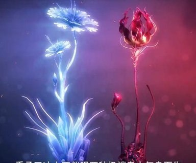
a couple of flowers that are next to each other, a computer rendering by Makoto Shinkai, cg society contest winner, fantasy art, unreal engine, unreal engine 5, playstation 5 screenshot
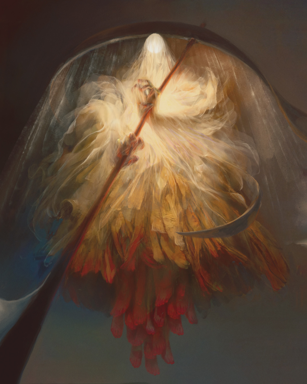
a painting of a woman holding a sword, a digital painting by Peter Mohrbacher, trending on Artstation, metaphysical painting, speedpainting, made of feathers, digital painting

0	ViT-B/32	a digital painting (35.3%)	by Peter Mohrbacher (3.5%)	trending on Artstation (30.3%)	metaphysical painting (11.6%)	digital painting (13.0%), speedpainting (9.0%)...
1	ViT-B/16	a digital painting (17.3%)	by Charlie Bowater (2.0%)	featured on Artstation (18.8%)	metaphysical painting (12.2%)	made of feathers (12.5%), speedpainting (9.9%)...
2	RN50	a digital painting (30.6%)	by Aleksander Kotsis (1.0%)	cgsociety (24.8%)	metaphysical painting (13.5%)	speedpainting (26.1%), made of feathers (13.7%...
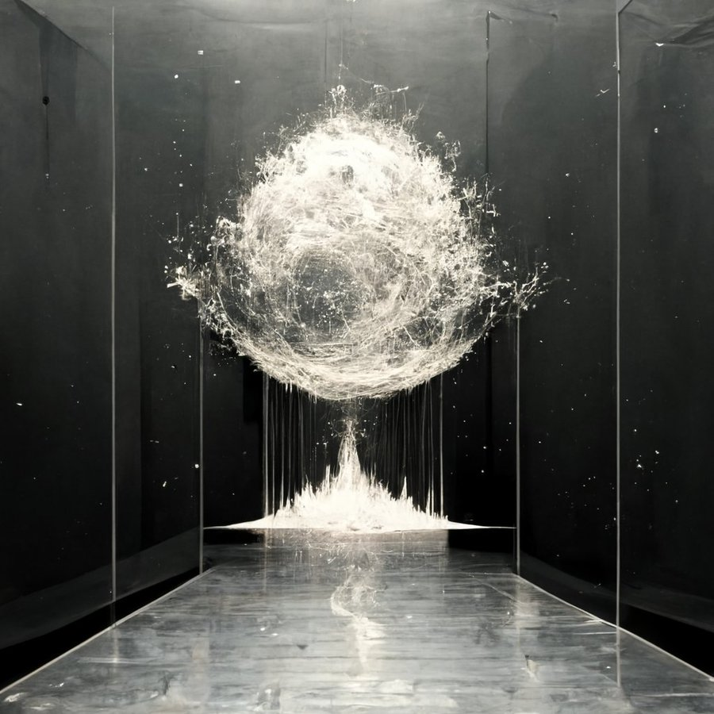
    empty space is filled by virtual particles #midjourney
    
Majestic and regal portrait of an awe inspiring High Elf nobility, intricate, epic, elegant, menacing, fantasy, photo realistic, digital painting, hard focus, beautiful volumetric lighting, epic light, ultra detailed, by Leesha Hannigan, Ross Tran, Thierry Doizon, Kai Carpenter, Ignacio Fernández Ríos" -C 17.5 -n 9 -i
    
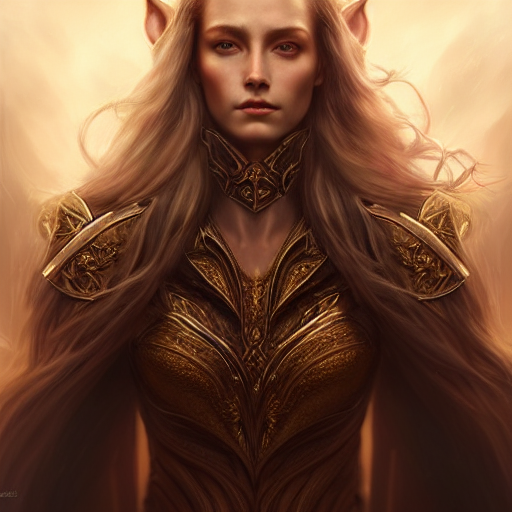
    


Dreamt in 18.11s for @lemonpepper's !dream "4K headshot of godlike Saiyan with defined arms and open hands and bloody clothes with vibrantly colored giant mandala wings , intricate face , flawless anime cel animation by Kentaro Miura, psychedelic , highly detailed upper body , professionally post-processed , beautiful, scary, symmetry accurate features, epic, octane rendered, anime masterpiece, accurate" -n 9 -i -s 150 -S 383637221 The seeds for each individual image are: [2076655672, 383637221, 1347281010, 1995160254, 1993011530, 4241282460, 3343368729, 155342372, 3118088561]    !dream "Majestic and regal portrait of a riveting and awe inspirin female High Elf nobility, intricate, epic, elegant, menacing, fantasy, photo realistic, digital painting, hard focus, beautiful volumetric lighting, epic light, ultra detailed, by Leesha Hannigan, Ross Tran, Thierry Doizon, Kai Carpenter, Ignacio Fernández Ríos" -C 12.25 -n 9 -i
    
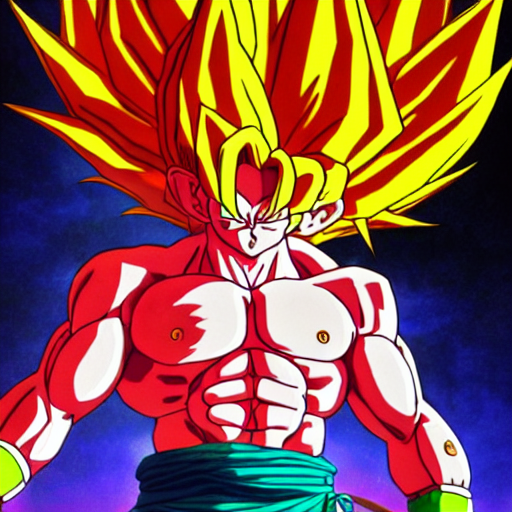
 !dream "4K headshot of godlike Saiyan with defined arms and open hands and bloody clothes with vibrantly colored giant mandala wings , intricate face , flawless anime cel animation by Kentaro Miura, psychedelic , highly detailed upper body , professionally post-processed , beautiful, scary, symmetry accurate features, epic, octane rendered, anime masterpiece, accurate" -n 9 -i -s 150 -S 383637221 The seeds for each individual image are: [2076655672, 383637221, 1347281010, 1995160254, 1993011530, 4241282460, 3343368729, 155342372, 3118088561]
 
 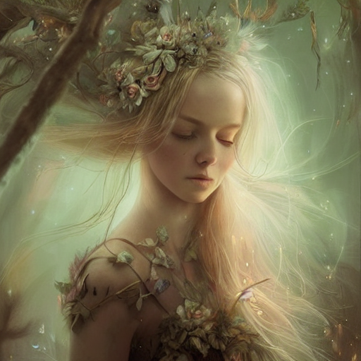
 
 ```
 ERROR: unrecognized arguments: -150

usage: !dream [-h] [--height HEIGHT] [--width WIDTH] [--cfg_scale CFG_SCALE]
              [--number NUMBER] [--separate-images] [--grid]
              [--sampler SAMPLER] [--steps STEPS] [--seed SEED]
              [--prior PRIOR]
              [prompt ...]

positional arguments:
  prompt

optional arguments:
  -h, --help
  --height HEIGHT, -H HEIGHT
                        [512] height of image (multiple of 64)
  --width WIDTH, -W WIDTH
                        [512] width of image (multiple of 64)
  --cfg_scale CFG_SCALE, -C CFG_SCALE
                        [7.0] CFG scale factor
  --number NUMBER, -n NUMBER
                        [1] number of images
  --separate-images, -i
                        Return multiple images as separate files.
  --grid, -g            Composite multiple images into a grid.
  --sampler SAMPLER, -A SAMPLER
                        [k_lms] (ddim, plms, k_euler, k_euler_ancestral,
                        k_heun, k_dpm_2, k_dpm_2_ancestral, k_lms)
  --steps STEPS, -s STEPS
                        [50] number of steps
  --seed SEED, -S SEED  random seed to use
  --prior PRIOR, -p PRIOR
                        vector_adjust_prior
 ```
 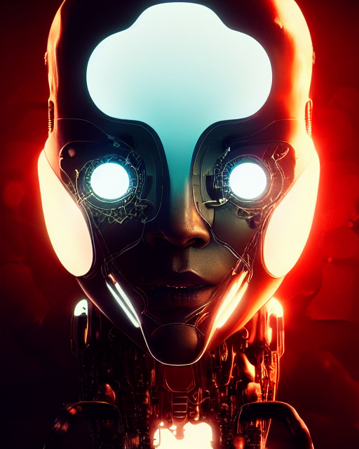
 !dream cyborg removing her human mask revealing wires and gears behind her face, white mask, futuristic, y2k aesthetic, dramatic lighting, illustration by Greg rutkowski, yoji shinkawa, 4k, digital art, concept art, trending on artstation -H 640 -C 12.0 -n 9 -i
 
 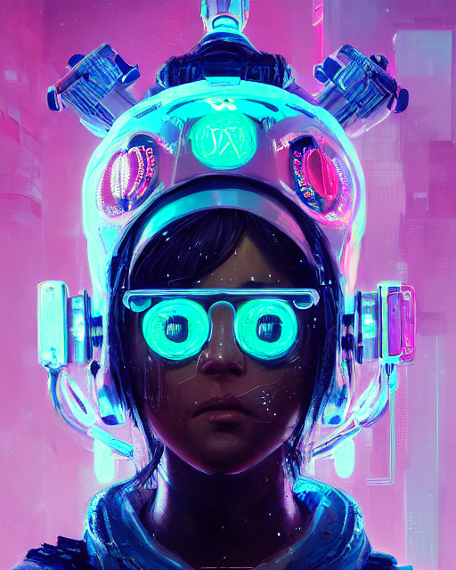
 !dream "detailed portrait Neon Operator Girl, cyberpunk futuristic neon, reflective puffy coat, decorated with traditional Japanese ornaments by Ismail inceoglu dragan bibin hans thoma greg rutkowski Alexandros Pyromallis Nekro Rene Maritte Illustrated, Perfect face, fine details, realistic shaded, fine-face, pretty face   
 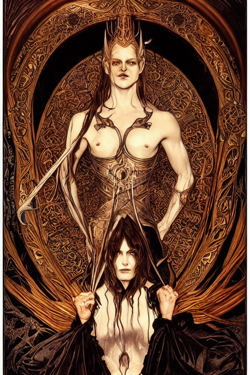
 Elden Ring, Lord of the Rings themed tarot card, the dark lord Sauron by Artgerm, Wlop, Alphonse Mucha and Gustave Dore, in the style of Midjourney, highly detailed and intricate artwork, masterpiece, majestic, ephemeral, cinematic lighting, vivid and vibrant colors, movie poster character production art concept, haunting, horror, gothic fog ambience, crimson fire palette, Artstation trending, unreal engine, octane render
 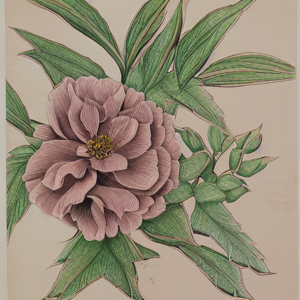
 !dream "the finest lithographic botanical illustration of a floral skeleton, pastel palette, by Elizabeth Twinning" -n 4 -i -S
     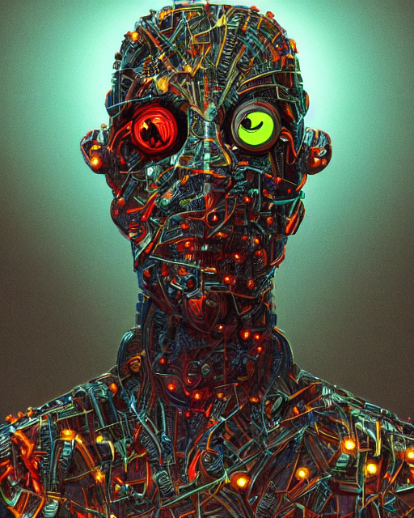
 
 "portrait of Tennis Ball Monster as a cyborg. intricate abstract. intricate artwork. by Tooth Wu, wlop, beeple, dan mumford. mulholland drive by david lynch, dune by david lynch, octane render, trending on artstation, greg rutkowski very coherent symmetrical artwork. cinematic, hyper realism, high detail, octane render, 8k, iridescent accents" -H 640 -n 9 -i -S
 
 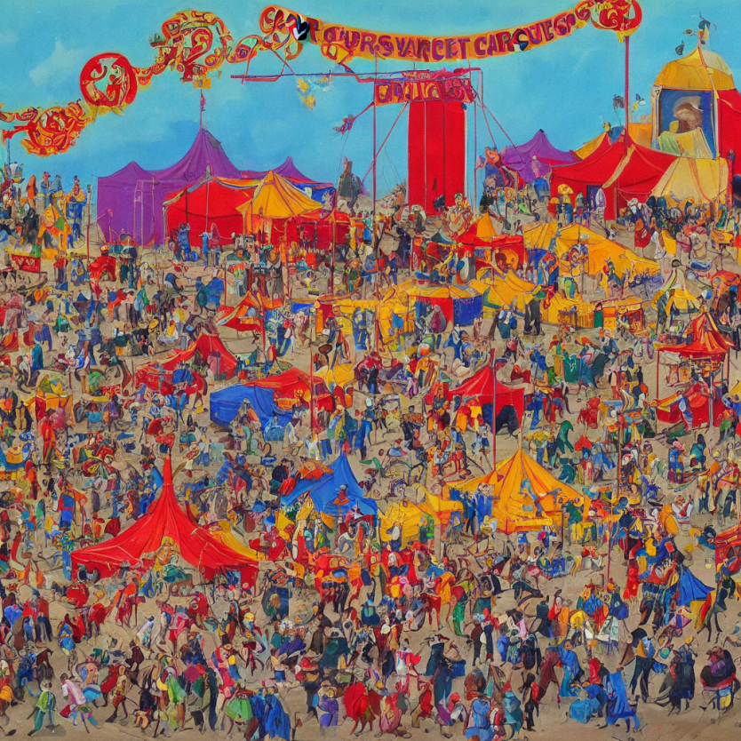
 
 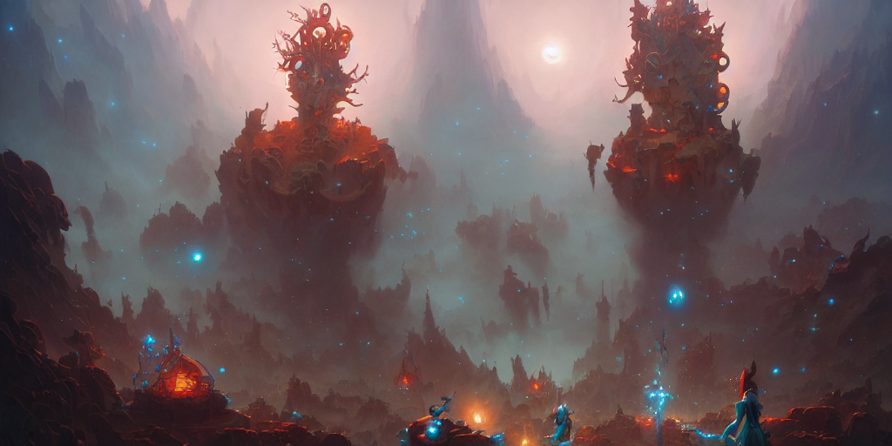
 The Realm Dimension of the Self-Transforming Machine Elves, by Peter Mohrbacher and Andreas Rocha and Craig Mullins
 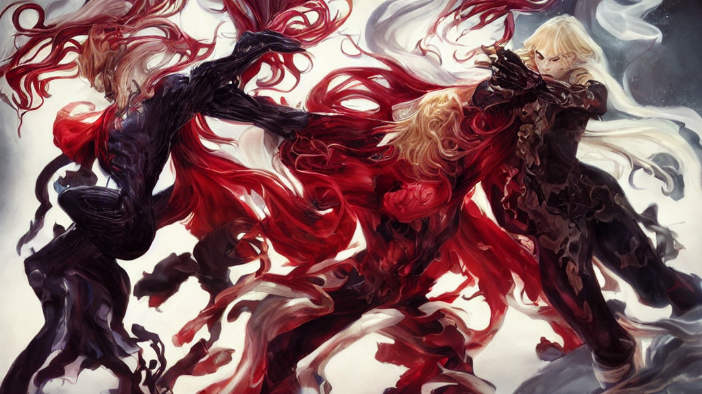
 "resonant red Venom and his alter ego Lucius fighting side by side, the ivory pale blond prince with pretty opal eyes by Ross tran, long fluffy blond curls, hooked nose high cheekbones and square jaw" -H 576 -W 1024 -n 6
 
 https://discord.com/channels/1002292111942635562/1005627160410722305/1007050395123728404
 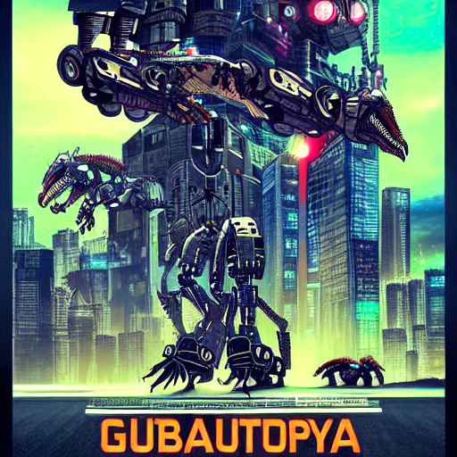
 !dream "beautiful detailed movie poster, urban gang of robot mecha dinosaurs, cyberpunk, city, crime, dystopian" -C 11.0 -n 9
 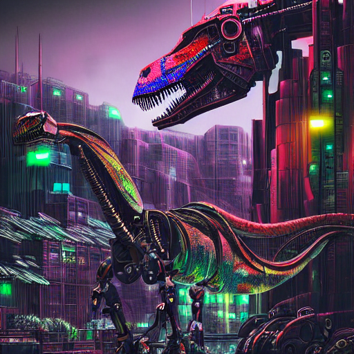
 https://discord.com/channels/1002292111942635562/1005627952261775390/1006329313987133490
 !dream "beautiful detailed render, psychedelic titan robot mecha dinosaurs, cyberpunk, city, urban, dystopian" -C 11.0 -n 9
 
 https://discord.com/channels/1002292111942635562/1005625691146047548/1007145388853174333
 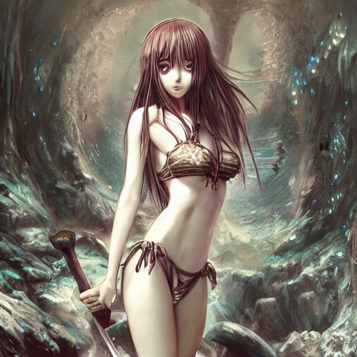
 portrait of a pretty anime girl in bikini standing in a grotto, holding a sword, intricate, elegant, highly detailed, lovecraft, digital painting, artstation, concept art, smooth, sharp focus uhd 8 k, dark, atmospheric, santiago caruso, chris cunningham " -n 9
 https://discord.com/channels/1002292111942635562/1005626539460800604/1007179855131054100
 
 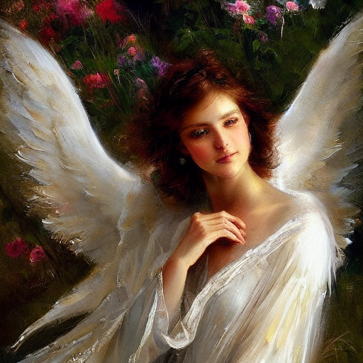
 beautiful portrait of an angel with beautiful face and her huge white wings spread out gracefully, painted by daniel gerhartz, highly detailed, beautiful warm illumination, graceful and elegant, ethereal " -n 9
 
 https://discord.com/channels/1002292111942635562/1005625691146047548/1007220377790976061
 !dream "the face of a ridiculously beautiful and cute japanese girl partially made of tomatoes, an ultrafine detailed illustration by james jean, final fantasy, intricate linework, bright colors, behance contest winner, vanitas, angular, altermodern, unreal engine 5 highly rendered, global illumination, radiant light, detailed and intricate environment " -n 9
 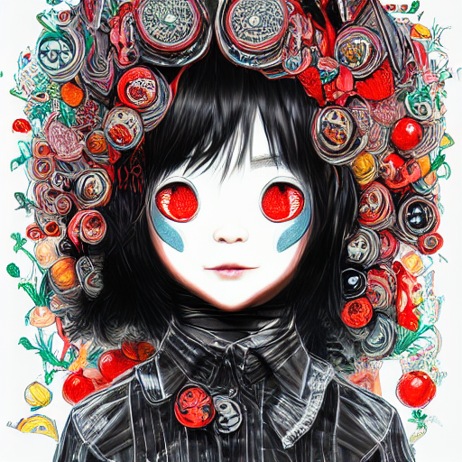
 
 
 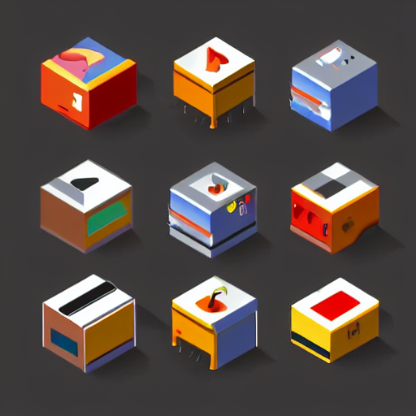
 https://discord.com/channels/1002292111942635562/1005625691146047548/1007256232526102548
 !dream "a team isometric 3 d icons, 8 k resolution, vector image, stock vector icons - c 1 9 " -n 4
 
 !dream "a mini world in a glass bottle octane render hyperdetailed "
 
 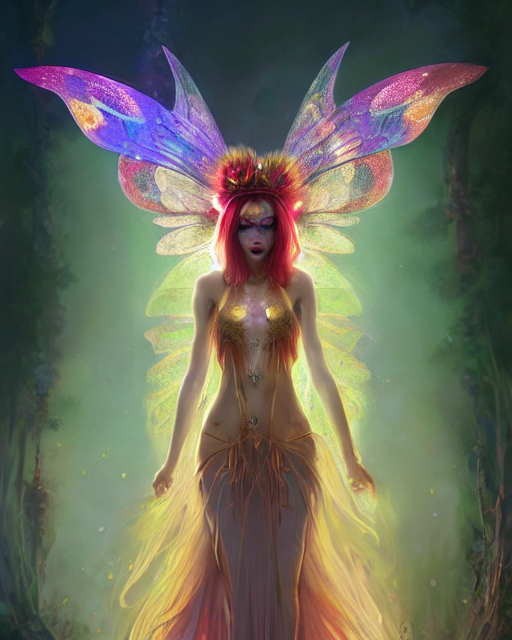
 !dream "stunningly beautiful female faerie priestess in amanita muscaria forest landscape, symmetrical wings on back, neon hair, fantasy art, wearing a dress of gossamer gold, dark light night, sharp focus, digital painting, 4 k, concept art, art by wlop, greg rutkowski and alphonse mucha, brom, face by otto schmidt " -H 640 -C 10.0 -n 9
 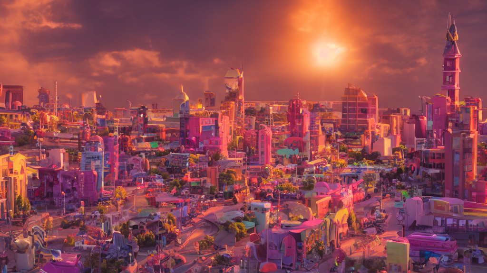
 !dream "a beautiful photograph of barbies city, sunset lighting, rim light, hyper realistic, 1 0 5 mm, cinematic frame " -H 576 -W 1024 -n 9
 
  her huge white wings spread out gracefully
  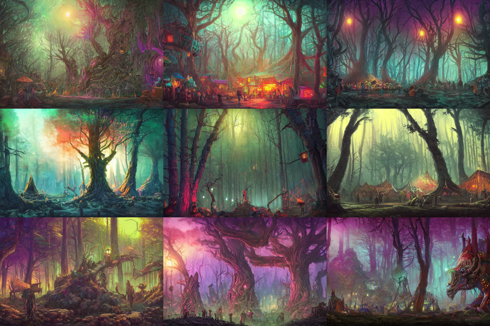
  !dream "festival in a town, bazar, yggdrasil growing in a dark forest, ancient city, colorfully, dark mood, detailed illustration, dark climate, digital art, highly saturated colors, overdetailed art, concept art, detailed illustration, hd, 4 k, digital art, greg, dan mumford, rutkowski, wlop, trending on artstation " -W 768 -n 9
  
 https://discord.com/channels/1002292111942635562/1005597469645742170/1007319778341425282
 
 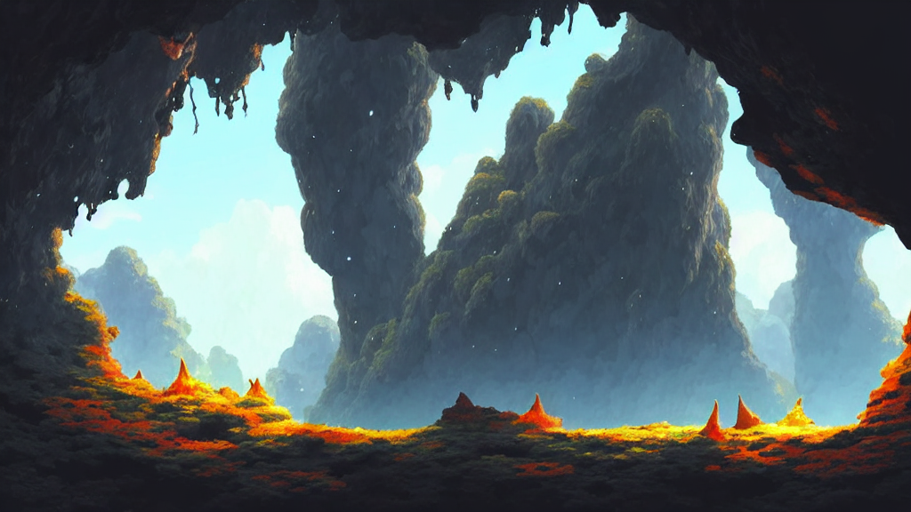
 
 !dream "side view internal landscape of a volcanic cave, studio ghibli, pixar and disney animation, sharp, rendered in unreal engine 5, highly detailed, digital painting, artstation, concept art, smooth, sharp focus, illustration, wide angle, artbook, wallpaper, splash art, hollow knight, promo art, dramatic lighting, art by artgerm and greg rutkowski and bo chen and jin xiaodi " -H 576 -W 1024 -C 14.6 -n 9
 
 !dream "a entire universe inside a crystal ball, concept art, octane render, unreal engine 5, trending on artstation, high quality, 8 k, highly detailed, hyperrealistic, path traced, house background, high contrast, masterpiece, epic, fantasy, dramatic lighting, cinematic, high coherence " -H 832 -W 832 -n 6
 
 https://discord.com/channels/1002292111942635562/1005597469645742170/1007360489514336458
 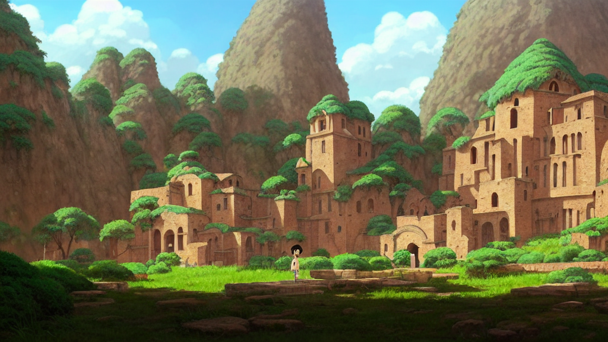
 !dream "ancient monastery ruins, studio ghibli, pixar and disney animation, sharp, rendered in unreal engine 5, highly detailed, digital painting, artstation, concept art, smooth, sharp focus, illustration, wide angle, artbook, wallpaper, splash art, promo art, dramatic lighting, art by artgerm and greg rutkowski and bo chen and jin xiaodi " -H 576 -W 1024 -C 14.6 -n 9 -i -s 150
 dream "a model sheet contaning a hero in the front back and side views, proportions, " -W 768 -C 12.0 -n 9 -i -s 150
 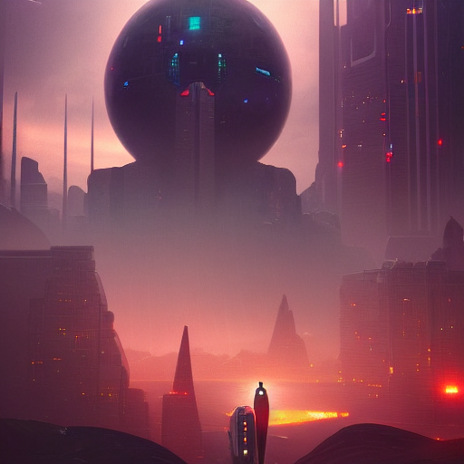
 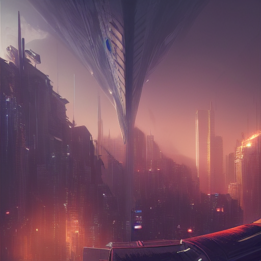
 !dream "the call of the void, futuristic cityscape, unreal 5 render, studio ghibli, history painting, digital art, octane render, beautiful composition, trending on artstation, award - winning photograph, masterpiece " -C 8.0 -n 9
 
 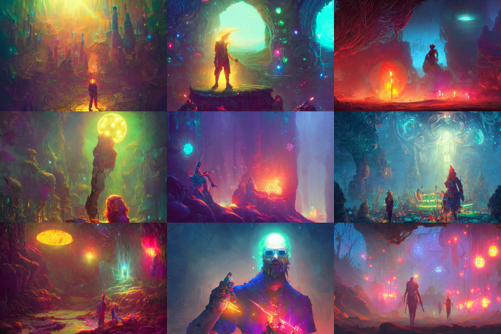
 
 !dream "transparent shining figure in tavern, glowing lights, epic fantasy, colorfully, detailed illustration, digital art, highly saturated colors, overdetailed art, concept art, detailed illustration, hd, 4 k, digital art, greg rutkowski, dan mumford, trending on artstation " -W 768 -n 9
 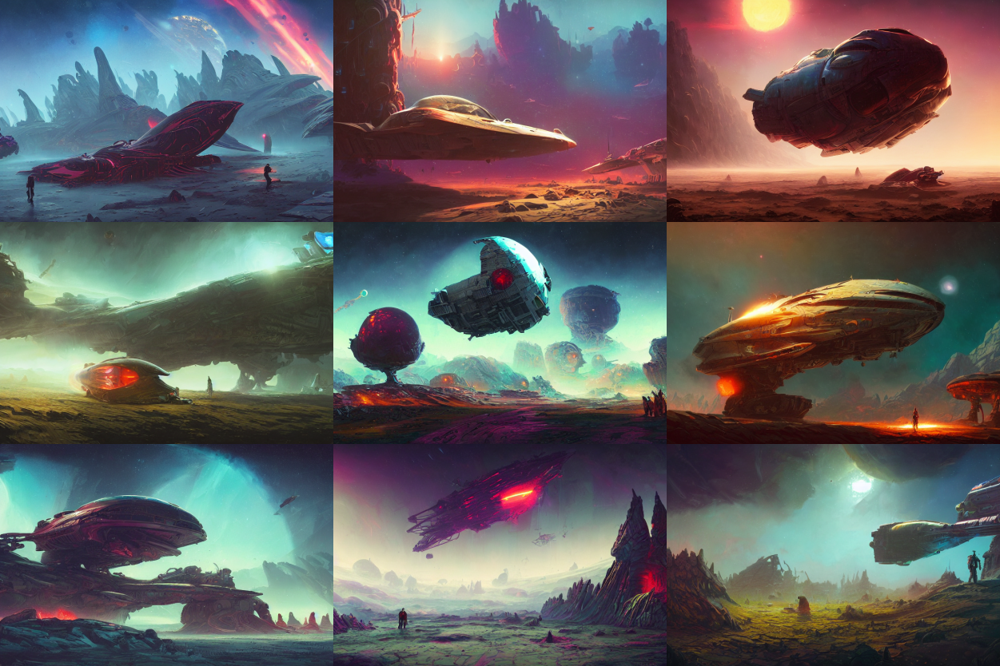
 a spaceship crash - lands on a strange planet, epic fantasy, colorfully, dark mood, detailed illustration, dark climate, digital art, highly saturated colors, overdetailed art, concept art, detailed illustration, hd, 4 k, digital art, greg rutkowski, dan mumford, wlop, trending on artstation " -W 768 -n 9
 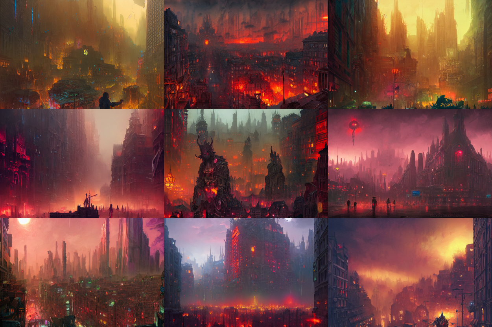
 !dream "a city overrun by a giant demon, colorfully, dark mood, detailed illustration, dark climate, digital art, highly saturated colors, overdetailed art, concept art, detailed illustration, hd, 4 k, digital art, greg rutkowski, dan mumford, wlop, trending on artstation " -W 768 -n 9
 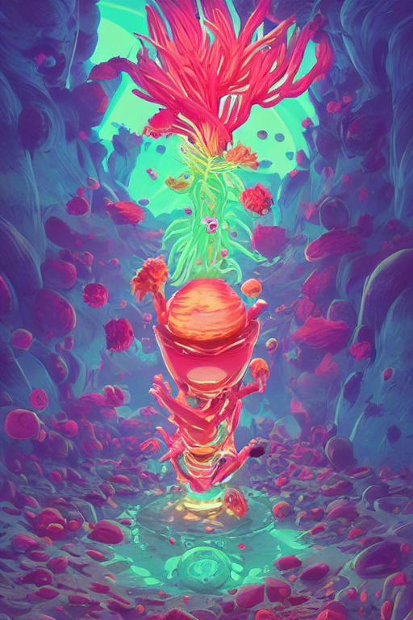
 !dream "roots cactus sushi cristal smurf ghost creature animal sushi cristal very big eye roots cactus elemental flush of force nature micro world fluo fishscale, behance hd by jesper ejsing, by rhads, makoto shinkai and lois van baarle, ilya kuvshinov, rossdraws radiating a glowing aura global illumination ray tracing hdr " -H 768 -n 9
 
 
 
 https://discord.com/channels/1002292111942635562/1005625691146047548/1007513405764149289
 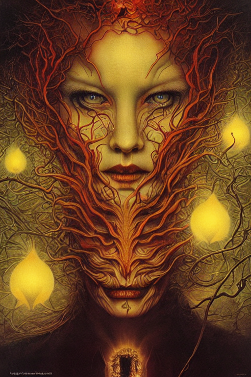
 !dream "hell, people suffering, evil spirits roam with lanterns, psychedelic lights and fog, zdzislaw, ayami kojima, yamamoto, barclay shaw, karol bak, hyperrealist, 8 k " -H 768 -C 10.0 -n 9 -i -s 150 
 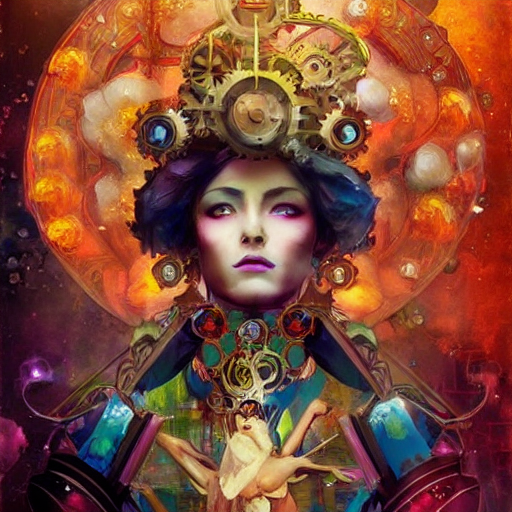
 !dream "an epic painting of the queen empress of time tarot card art, lomo effect, beautiful vibrant mixed pastels and watercolors painting, clockwork steampunk, cgsociety # conceptart cg character art, # oc by ross tran by ashley wood, stephanie hans and vanessa lemen inspired face " -n 9
 
 
 !dream "a dmt trip, ultra realistic, cinematic, cinematic, wide angle, intricate details, cyborg, highly detailed by caravaggio, aaron horkey, boris vallejo, wayne barlowe, craig mullins, roberto ferri " -H 640 -C 40.0 -n 9 -g -s 150
 
 !dream "an astonishing and hilarious jean giraud work of art of sasha and anne shulgin in the style of a renaissance masters portrait, mystical and new age symbolism and tibetan book of the dead imagery, intricately detailed, chemisty theme, 4 k " -W 832 -C 9.0 -n 9
 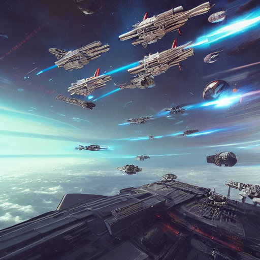
 
 !dream "3 d point perspective, extreme long shot of the imperial fleet hovering over deep space menacingly, beginning to bombard with blaster fire, deep depth of field, make all elements sharp, aerial view, 8 k, octane, unreal 5, hyperrealistic, symmetrical, intricate digital art, photoshop, epic space battle " -n 9
 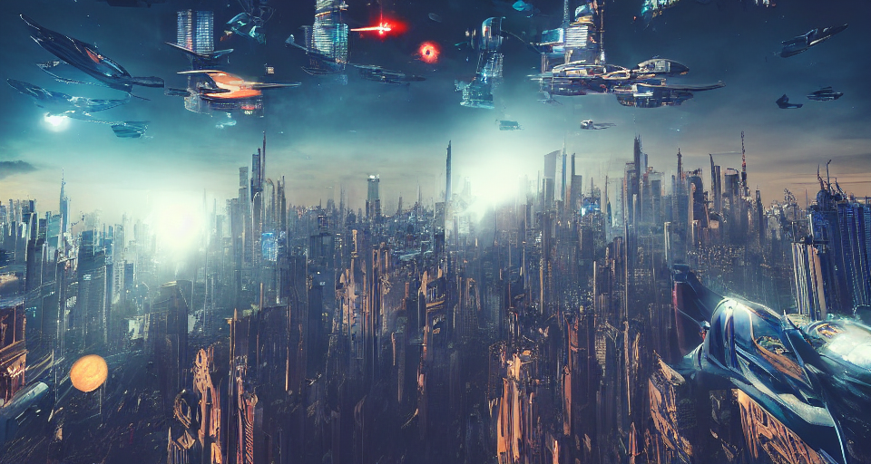
 !dream "3 d point perspective, extreme long shot of spaceships hovering over the sky menacingly of cyberpunk gothic new york city, spacefighters patrolling around, occupation about to begin, golden hour, deep depth of field, make all elements sharp, aerial view, 8 k, octane, unreal 5, hyperrealistic, symmetrical, intricate digital art, photoshop, cgi, 3 d rendered model " -W 960 -n 9
 
 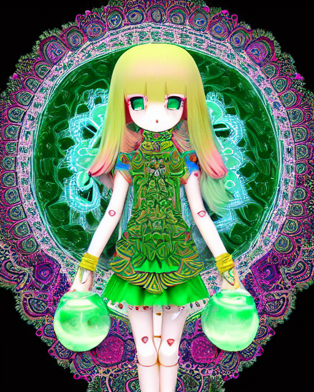
 !dream "fractal mandala funny nendroid nendroid girl very funny joy emoji psy trip ghost color an ancient white bone and emerald gemstone relic, intricate engraving concept art style " -H 640 -C 9.0 -n 9
 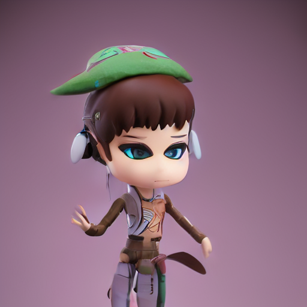
 !dream "very funny nendroid for laugh to pain, impossible funny hyperrealistic trending on artstation, octane render " -n 9 -i -s 10
 
 
 !dream "humanoid god of the sun, highly detailed, d & d, fantasy, hyper detailed, digital painting, trending on artstation, apollo, concept art, sharp focus, illustration, art by artgerm and magali villeneuve and greg rutkowski and michael whelan, cryengine, 8 k realistic atmospheric lighting, frostbite 3 engine " -H 768 -C 10.0 -n 9 -i -s 150
 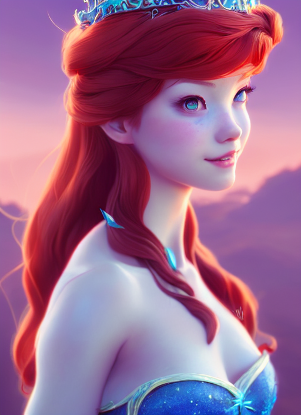
 !dream "beautiful happy princess ariel disney, character art, art by artgerm lau and wlop and and ilya kuvshinov and john singer sargent, hyperdetailed, 8 k realistic, symmetrical, frostbite 3 engine, cryengine, dof, trending on artstation, digital art " -H 704 -C 10.0 -n 5
 
 https://discord.com/channels/1002292111942635562/1005626075667247205/1007772168886689844
 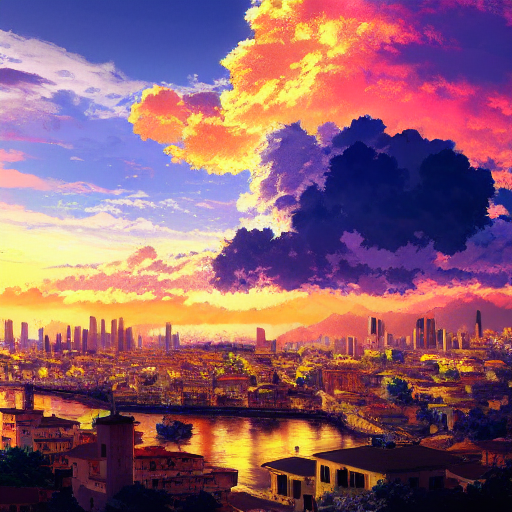
 !dream "key anime visual portrait of an italian city sunset, cumulonimbus clouds, modern anime still, 4 k " -n 9
 !dream "key anime visual portrait of an italian city in the background at sunset, cumulonimbus clouds, modern anime still, 4 k " -n 9 更一得到城市
 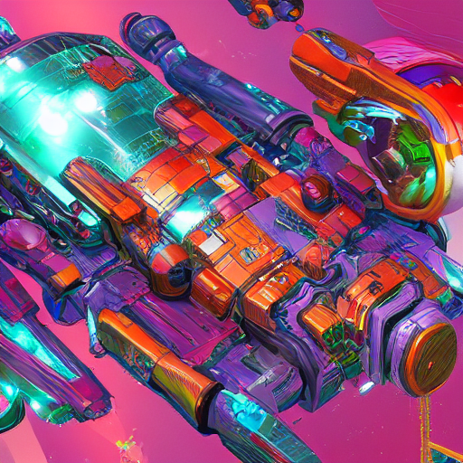
 !dream "a decompression algorithm in progress, cybperspace, colourful, high detail, vivid, beautiful, trending on artstation " -n 6
 
 https://discord.com/channels/1002292111942635562/1005626075667247205/1007775025471950889
 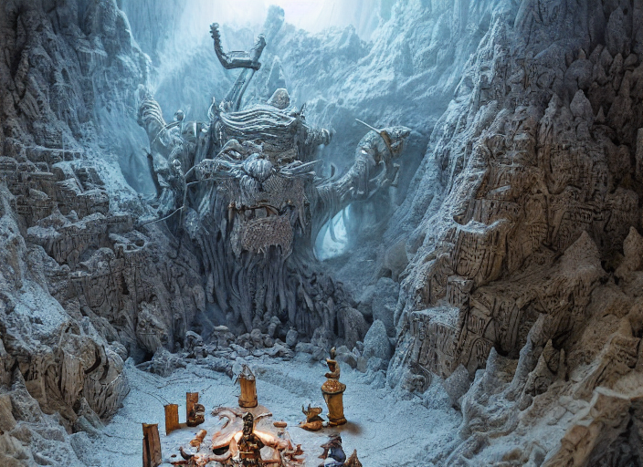
 !dream "medium format photograph of a diorama of moria, balrog, gandalf, skyrim, detailed, by joop geesink, wes anderson, jim henson, brian froud, breathtaking, 8 k resolution, beautiful lighting, studio light, extremely detailed, establishing shot, realistic materials, hasselblad!!!, hyperrealistic " -W 704 -n 9
 
 https://discord.com/channels/1002292111942635562/1005626075667247205/1007779903762092106
 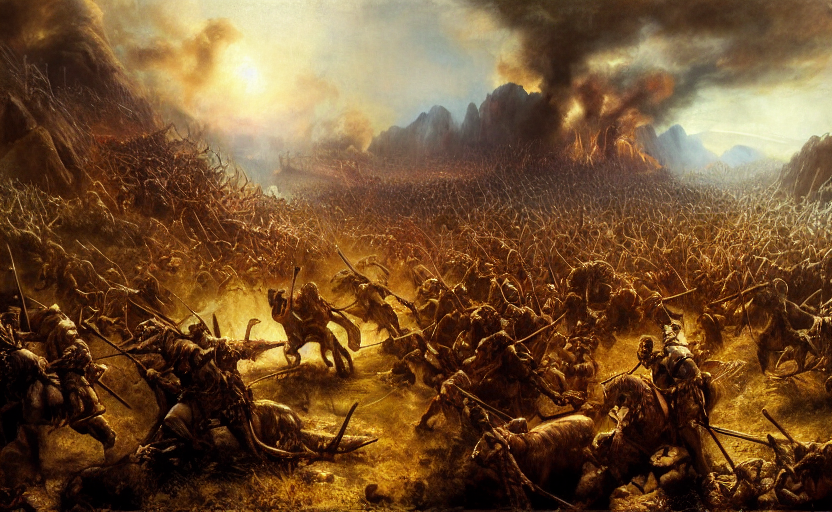
 !dream "realistic oil painting of the battle of the pelennor fields, detailed, by rembrandt van rijn, lisa frank, hr giger, beksinski, anato finnstark, 8 k resolution, beautiful lighting, studio light, extremely detailed, establishing shot, realistic materials, hyperrealistic " -W 832 -n 9
 
 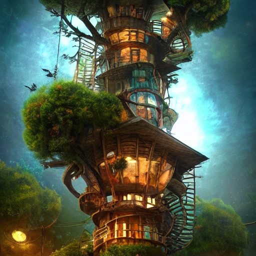
 !dream "tree houses in a solar punk future, trending on artstation, octane rendering, cinematic lighting, camera obscura, water color texture, inspired by da vinci, inspired by rembrandt, inspired by ghibli, inspired by alan moore, inspired by blade runner, hyper realistic detail, very very very detailed, super detailed " -n 6
 树屋
 
 
 
 
 https://discord.com/channels/1002292111942635562/1005626075667247205/1007782952656195674 雪原设定
 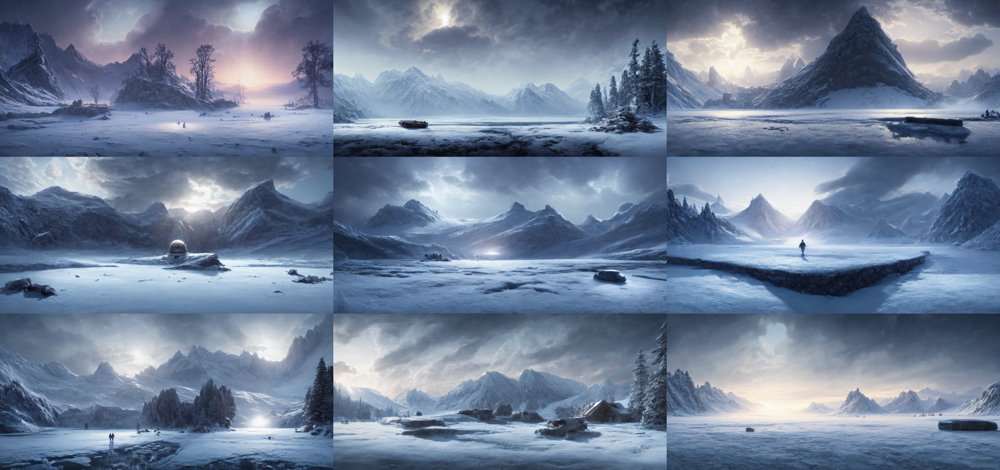
  !dream "beautiful render of a winter landscape, unreal engine, first light, majestic mountains, frozen lake, snow, dramatic clouds, abandoned alien ship, soft light, by greg rutkowski, cgsociety " -W 1088 -C 10.0 -n 9 -g -s 75
  
  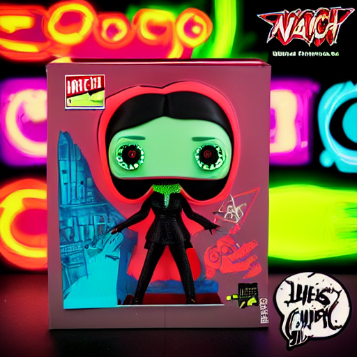
 https://discord.com/channels/1002292111942635562/1005625691146047548/1007839185111093259
  !dream "neon witch stop motion vinyl action figure, plastic, toy, butcher billy style " -n 9
  
  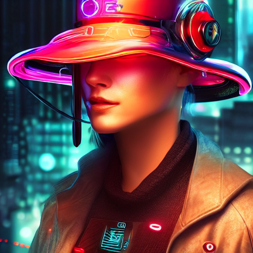
 
 !dream "a hat from the future, cyberpunk, highly detailed, epic lighting, hyper photorealism, 8 k " -n 9 
 
 
 
 
 
 
 
 
 
 
 
 
 
 
 
 
 
 
 
 
 
 
 
 
 
1
