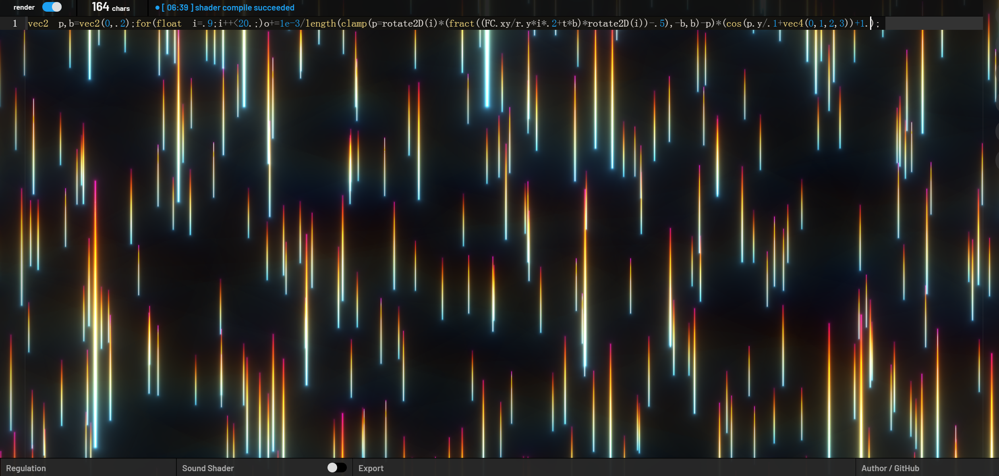

```
vec2 p,b=vec2(0,.2);for(float i=.9;i++<20.;)o+=1e-3/length(clamp(p=rotate2D(i)*(fract((FC.xy/r.y*i*.2+t*b)*rotate2D(i))-.5),-b,b)-p)*(cos(p.y/.1+vec4(0,1,2,3))+1.);
```
https://twigl.app/?ol=true&mode=7&source=vec2%20p,b%3Dvec2(0,.2)%3Bfor(float%20i%3D.9%3Bi%2B%2B%3C20.%3B)o%2B%3D1e-3/length(clamp(p%3Drotate2D(i)*(fract((FC.xy/r.y*i*.2%2Bt*b)*rotate2D(i))-.5),-b,b)-p)*(cos(p.y/.1%2Bvec4(0,1,2,3))%2B1.)%3B



It's difficult to say what this code does exactly without more context, but it appears to be performing some kind of transformation on a 2D vector using rotation and clamping, and using the resulting value to modify a variable called o.

It looks like this is a piece of code that generates some sort of visual effect using a loop and some mathematical operations. Here's a breakdown of what each line does:

1.  Declares two variables, `p` and `b`, both of type `vec2`. `vec2` is a data type that represents a 2D vector with `x` and `y` components. `p` is set to an initial value of `vec2(0, .2)`. `b` is set to an initial value of `vec2(0, .2)`.

2.  Begins a `for` loop that will iterate from `.9` to `20.`, incrementing by `1.` each time.

3.  Inside the loop, `o` is incremented by some value that is calculated using `p`, `b`, and some other variables.

4.  `p` is set to the result of `rotate2D(i) * (fract((FC.xy/r.y*i*.2+t*b)*rotate2D(i))-.5)`, which is then clamped to the range `[-b, b]` using the `clamp()` function.

5.  The length of the resulting value from step 4 is calculated using the `length()` function.

6.  The value from step 5 is used to divide `1e-3`, and the result is added to `o`.

7.  The loop ends, and the final value of `o` is returned.

It's difficult to say what this code does exactly without more context, but it appears to be performing some kind of transformation on a 2D vector using rotation and clamping, and using the resulting value to modify a variable called `o`.