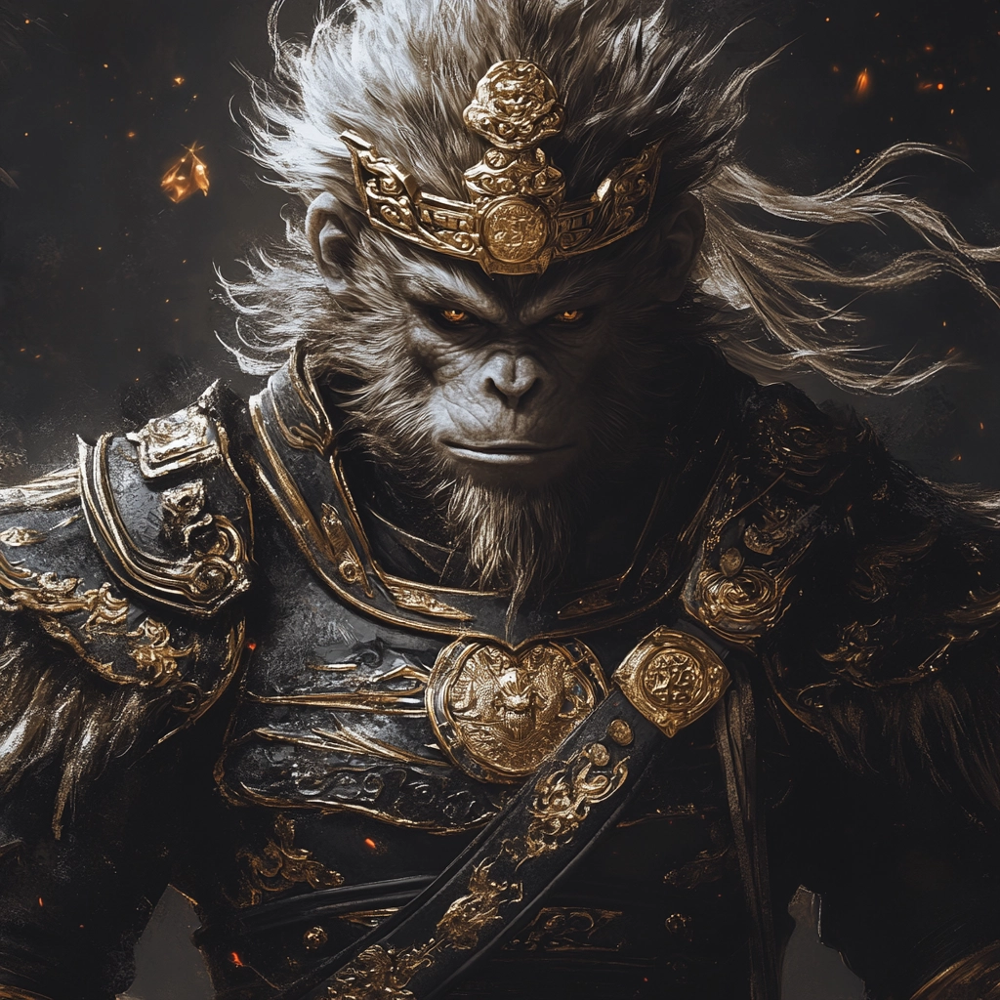

The Monkey King with black and white illustrations, Black Myth: Wukong, Golden Hoop, exaggerated movements, in the style of digital art, wearing armor in ancient battlefield environment, decorated with golden armor, with light golden hair, realistic depiction of head fur details, dark background, high contrast lighting, highlighting the characteristics of the character. Look at this black armor, embedded with golden totems, every detail reveals extraordinary and mysterious. Especially the golden badge on the right arm, it's a symbol of strength and glory!
黑白插画的孙悟空，黑神话：悟空，金箍，夸张的动作，以数字艺术的风格，在古老的战场环境中穿着盔甲，装饰着金色的盔甲，配上浅金色的头发，逼真地描绘了头部的毛皮细节，深色的背景，高对比度的灯光，突出了人物的特点。看看这件黑色的盔甲，镶嵌着金色的图腾，每一个细节都透露着非凡和神秘。尤其是右臂上的金色徽章，更是力量和荣耀的象征！

Black-and-white photograph of wine bottles in a rack, taken with a Kodak Portra film-style raw image.
架子上酒瓶的黑白照片，使用柯达 Portra 胶片风格的原始图像拍摄。

Enchanting forest glen with sun-dappled clearings, whimsical flora, hidden creatures, ethereal sanctuary, pencil strokes, high-quality, realistic
迷人的森林峡谷，阳光斑驳的空地，异想天开的植物群，隐藏的生物，空灵的避难所，铅笔笔触，高品质，写实
