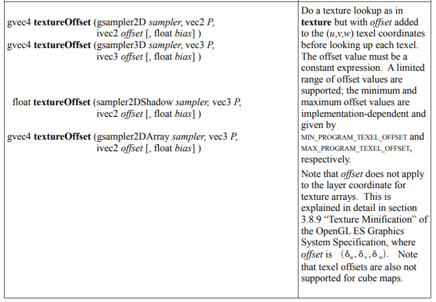

https://www.shadertoy.com/view/tld3Dn 赛博朋克画
https://www.shadertoy.com/view/XsBSDR cubemap展开
https://www.shadertoy.com/view/NtX3Ds 变化的水滴
https://www.shadertoy.com/view/fdyXWD 图片拼接cubemap展开图
https://www.shadertoy.com/view/WtlSD4 cubemap6分图


默认
```
void mainCubemap( out vec4 fragColor, in vec2 fragCoord, in vec3 rayOri, in vec3 rayDir )
{
    // Ray direction as color
    vec3 col = 0.5 + 0.5*rayDir;

    // Output to cubemap
    fragColor = vec4(col,1.0);
}
```

**samplerCube**： a handle for accessing a cube mapped texture

**samplerCubeShadow**： a handle for accessing a cube map depth texture with comparison

**isamplerCube** :a handle for accessing an integer cube mapped texture

**usamplerCube**:a handle for accessing an unsigned integer cube mapped texture

```
For Cube forms, the direction of P is used to select which face to do a 2-dimensional texture lookup in, as
described in section 3.8.10 “Cube Map Texture Selection” in the OpenGL ES Graphics System Specification.
```
对于立方体形式，P的方向用于选择在哪个面进行二维纹理查询，如OpenGL ES图形系统中的3.8.10节 "立方体贴图纹理选择 "所述。
在OpenGL ES图形系统规范的3.8.10节 "Cube Map Texture Selection "中描述。规范中所述。

```
Do a texture lookup as in texture but with offset added to the (u,v,w) texel coordinates before looking up each texel. The offset value must be a constant expression. A limited range of offset values are supported; the minimum and maximum offset values are implementation-dependent and given by MIN_PROGRAM_TEXEL_OFFSET and MAX_PROGRAM_TEXEL_OFFSET, respectively. Note that offset does not apply to the layer coordinate for texture arrays. This is explained in detail in section 3.8.9 “Texture Minification” of the OpenGL ES Graphics System Specification, where offset is u , v , w . Note that texel offsets are also not supported for cube maps.
```

