---
title: 2021-10-27shader1027
tags:  until 228 https://www.shadertoy.com/results?query=&sort=hot&from=2724&num=12
grammar_cjkRuby: true
--- 

* [色彩油墨](#色彩油墨)
* [视频或图片滤镜](#视频或图片滤镜)
* [3D音乐互动线条](#3d音乐互动线条)
* [3D材质球展示](#3d材质球展示)
* [3D模型代码](#3d模型代码)

https://www.shadertoy.com/view/fsGXWG 银河

https://www.shadertoy.com/view/Xdl3D2 苹果宣传的部分的代码

https://www.shadertoy.com/view/lss3Df
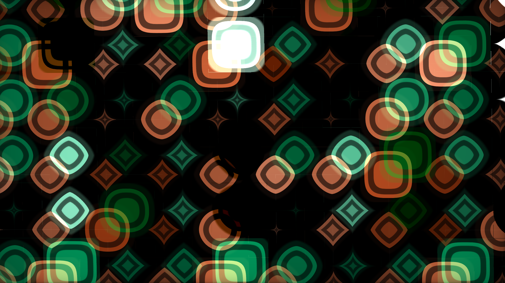

https://www.shadertoy.com/view/NstGzf
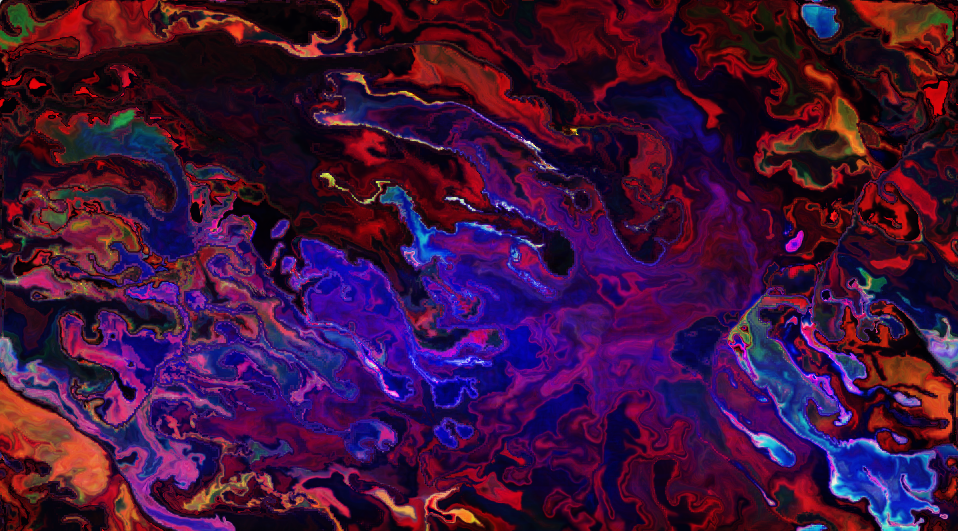

https://www.shadertoy.com/view/7s3XR2


https://www.shadertoy.com/view/XtjSDK 球变化


火焰燃烧效果

https://www.shadertoy.com/view/MdlXRS
球融合
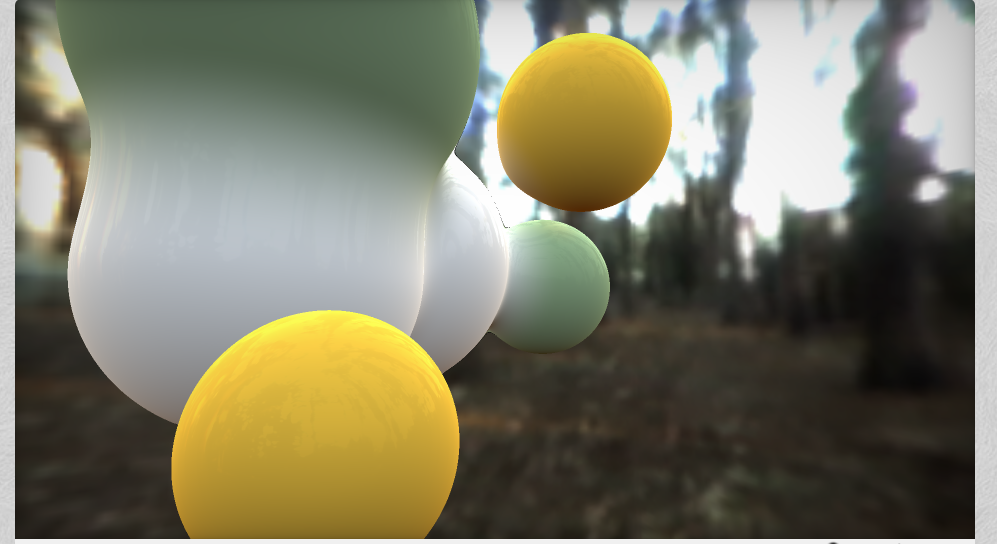
动态扩散

荧光效果 视频图片
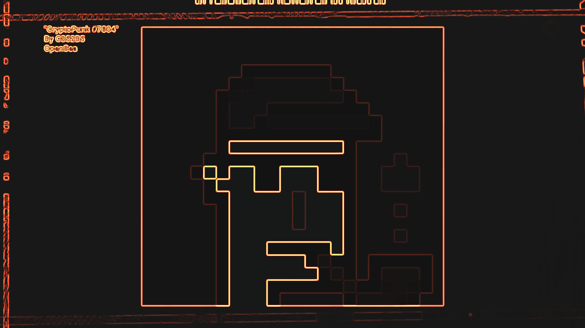
色彩斑斓的球
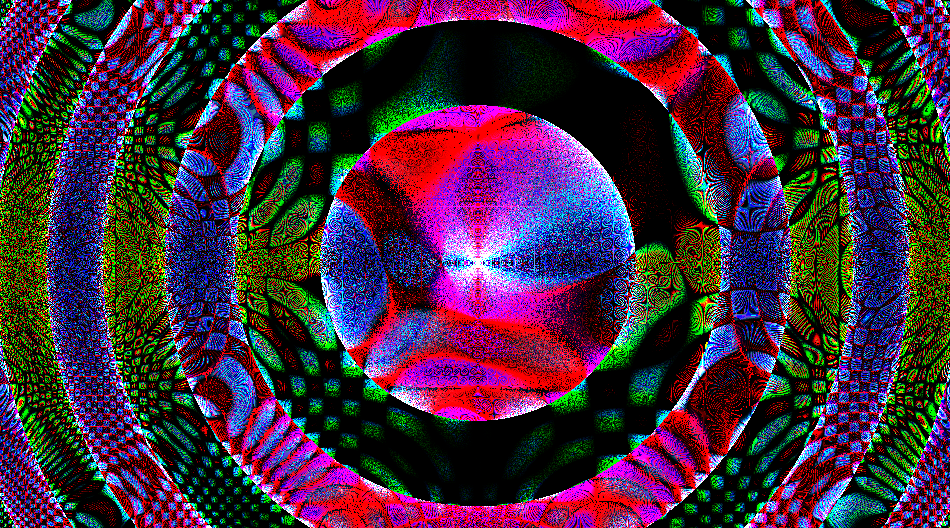
云
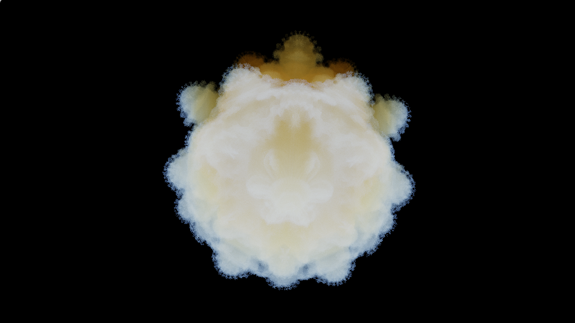

https://www.shadertoy.com/view/sllGRB
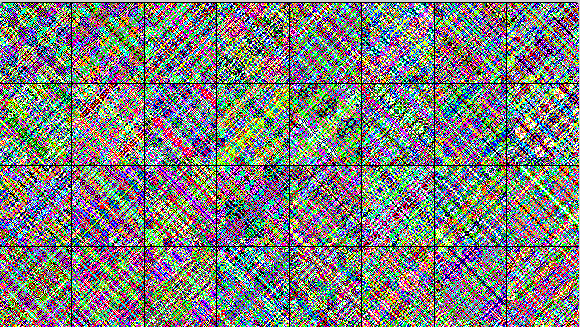

https://www.shadertoy.com/view/NsyXzw

人头
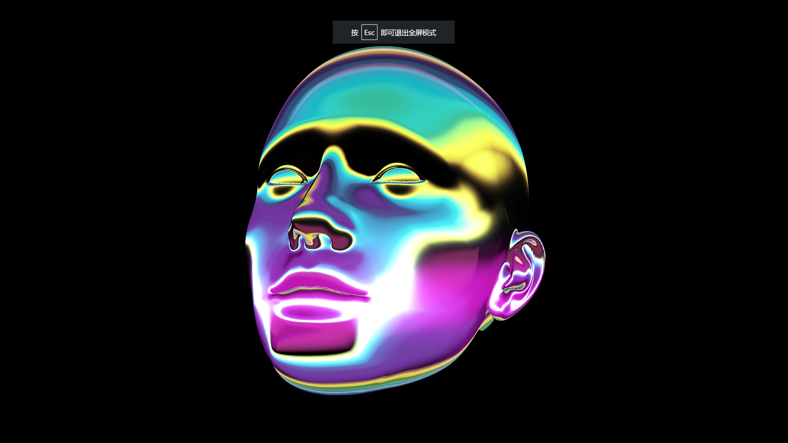
# 色彩油墨
https://www.shadertoy.com/view/4ldGDB
https://www.shadertoy.com/view/7dy3R3
https://www.shadertoy.com/view/NstSzf //重要
https://www.shadertoy.com/view/7sGGRD 图片油墨画色彩混合
https://www.shadertoy.com/view/lsyfWD 水彩混合重要
https://www.shadertoy.com/view/XdlGzH# 3DVR空间 可以加自己图  //重要
https://www.shadertoy.com/view/ldcyR4 幽默闭合线条
https://www.shadertoy.com/view/7syXDV  水彩 中文解释
https://www.shadertoy.com/view/wtXXD2 色彩云变化
https://www.shadertoy.com/view/7sjSWK 加载图片彩色笔模式
https://www.shadertoy.com/view/Xl2GRc 色彩环绕五星
https://www.shadertoy.com/view/NtsXWX 油墨环形
https://www.shadertoy.com/view/ttVczG 玻璃水滴 鼠标控制水滴大小 //重要
https://www.shadertoy.com/view/ltcXzs 字母变幻
https://www.shadertoy.com/view/NdyGWc 视觉曲线加彩色颗粒
https://www.shadertoy.com/view/7d3Xz8 彩色线条
https://www.shadertoy.com/view/Xt2BDG 彩色环
https://www.shadertoy.com/view/WsSXRy 3D彩卡
https://www.shadertoy.com/view/Ml2GWy 色彩方格  、、重要
https://www.shadertoy.com/view/4d3BWH 彩色闪动的珠子 重要
https://www.shadertoy.com/view/fsG3Wy 彩色分形
https://www.shadertoy.com/view/Nsy3Dd 图片随机分割
https://www.shadertoy.com/view/3tBGzh 互动彩色粒子 变幻 重要
https://www.shadertoy.com/view/7dKGzG 光彩之语
https://www.shadertoy.com/view/fdy3z3 六边形色块
https://www.shadertoy.com/view/ld3SDl 真实的泡泡材质 //重要
https://www.shadertoy.com/view/XdjSzD 弹珠内的彩色液体 //重要
https://www.shadertoy.com/view/ldtcWS 铅笔画  重要
https://www.shadertoy.com/view/MlcGWr 高度线
https://www.shadertoy.com/view/Ms33zj# 色彩线
https://www.shadertoy.com/view/fdjXWc 色彩圆形付环绕
https://www.shadertoy.com/view/lll3WB 彩色方块
https://www.shadertoy.com/view/wlj3Dc
https://shadertoy.com/view/4dyGDG 彩色线条
https://www.shadertoy.com/view/XsGfWt 彩色眼球 //重要
https://www.shadertoy.com/view/NsGSDh 中心旋转的色
https://www.shadertoy.com/view/slc3zn 彩色波动的虫子
https://www.shadertoy.com/view/7lc3zn 彩色扫描线
https://www.shadertoy.com/view/llsSDf 多个泡泡 无NOIse //重要
https://www.shadertoy.com/view/NdVSzy 超级粘稠油墨 //重要
https://www.shadertoy.com/view/NsKGDy  随机彩色块 //重要
https://www.shadertoy.com/view/WdB3Dw 彩色变化的环体 //
https://www.shadertoy.com/user/Taytweets 重要色环及色片光环
https://www.shadertoy.com/view/sdGSWV 色片光环
https://www.shadertoy.com/view/NdySWt 色模环（变色 https://www.shadertoy.com/view/ssGSD3 （不变色
https://www.shadertoy.com/view/sdGSD3 色片光环
https://www.shadertoy.com/view/7tt3Rn 变幻色片光环 
https://www.shadertoy.com/view/ssdGRX 图片解算混合 //重要
色彩油墨大户https://www.shadertoy.com/user/xenn //重要
https://www.shadertoy.com/view/7d3GW8 色片玻璃//重要
https://www.shadertoy.com/view/ltfXzj 超级油墨
https://www.shadertoy.com/view/ldBGRR 大色块融合飘动
https://www.shadertoy.com/view/7tjXzK 超级油墨扩散 
https://www.shadertoy.com/view/4df3D8 分解 合成 赫拉
https://www.shadertoy.com/view/Xd2Bzw 分形互动 //重要
https://www.shadertoy.com/view/ssc3Wr 彩色环绕螺旋
https://www.shadertoy.com/view/NdtXR8 色块
https://www.shadertoy.com/view/4sGSDw 彩色光点线条
https://www.shadertoy.com/view/3djSRd 彩色环条
https://www.shadertoy.com/view/XsVyDw 彩色对称线条
https://www.shadertoy.com/view/MlsGWX 彩色浮动的
https://www.shadertoy.com/view/Mdl3RH 
https://www.shadertoy.com/view/NsjGRG 彩色波浪
https://www.shadertoy.com/view/WdjGRc 向上的红黑彩色
https://www.shadertoy.com/view/MdVczy 色园点化
https://www.shadertoy.com/view/ldyfzD 扩散
https://www.shadertoy.com/view/XsXfzN 和音乐互动的蓝黑油墨 //重要
https://www.shadertoy.com/view/lssyzf 互动的超级油墨
https://www.shadertoy.com/view/lljfRV 色块无限分割
https://www.shadertoy.com/view/XdX3zs  扩散互动
https://www.shadertoy.com/view/tdfGz4 彩墨瀑布流
https://www.shadertoy.com/view/4lXyWS 中心对称分形油墨
https://www.shadertoy.com/view/MtfSDj 4分割 色彩格子
https://www.shadertoy.com/view/3tyXWw 3角面和正方形格子
https://www.shadertoy.com/view/3dlXRj 
https://www.shadertoy.com/view/llKcDR 中心收缩的色环 https://www.shadertoy.com/view/XsKBRw 发散的
https://www.shadertoy.com/view/lddBD7 分多融合
https://www.shadertoy.com/view/3ddXzH ki互动的油墨电视
发光的提 https://www.shadertoy.com/view/tlsyz2
https://www.shadertoy.com/view/tlyGRc 超多碎片化的视频和图片互动 //重要
https://www.shadertoy.com/view/XldSzf 四镜像体
https://www.shadertoy.com/view/3l2BR3 超级金属油墨 
https://www.shadertoy.com/view/tlycDV 磁力线色模
https://www.shadertoy.com/view/tdVcRy 中心求变幻
https://www.shadertoy.com/view/tsXfWS 彩色圈圈
https://www.shadertoy.com/view/WdXczM 互动的 特殊 油墨  //非常重要
https://www.shadertoy.com/view/ltGGWm 眼睛
https://www.shadertoy.com/view/WtScW3 地图色
https://www.shadertoy.com/view/WlK3WW 4层变色
https://www.shadertoy.com/view/3l3cWr 多重彩色变化  精致//重要
https://www.shadertoy.com/view/3tj3DV 噪点//重要
https://www.shadertoy.com/view/tlj3RR 6发散园彩波扩散 //重要
https://www.shadertoy.com/view/Nsd3RH 彩色网格 //重要
https://www.shadertoy.com/view/3sVBzR 发散的星星 //重要
https://www.shadertoy.com/view/3dBBRh 彩色立方 //重要//重要
https://www.shadertoy.com/view/3d3SRM 球上绘画油墨
https://www.shadertoy.com/view/fl33Rr 双层油墨
https://www.shadertoy.com/view/ttfcWn 彩色大小不等的球
https://www.shadertoy.com/view/wlVyzt 视频躲圈融合 //重要
https://www.shadertoy.com/view/wdBfWw 分形彩色
https://www.shadertoy.com/view/7sKXzK 变色的线条
https://www.shadertoy.com/view/7tjSRd 分形彩色世界 
地图生成 https://www.shadertoy.com/view/3d3cR2
https://www.shadertoy.com/view/fsdSRH
数字流https://www.shadertoy.com/view/lsXSDn
https://www.shadertoy.com/view/fsKSzy 色眼 //重要
https://www.shadertoy.com/view/NtXSzl 油墨眼睛 //非常重要 
https://www.shadertoy.com/view/XdSGzR 明丽色环 //重要 
https://www.shadertoy.com/view/fdVSzy 眼睛油墨
https://www.shadertoy.com/view/wsKXDh 蝴蝶扇动翅膀
https://www.shadertoy.com/view/3lfXW8 像素空间 
https://www.shadertoy.com/view/MdVBWz 彩色交织空间
https://www.shadertoy.com/view/XsjGRd 彩色交幻空间
https://www.shadertoy.com/view/4ttXzj 大脑细胞油墨
https://www.shadertoy.com/view/4dBSRK 色彩方块 //重要
https://www.shadertoy.com/view/wt23Rt 渐变的色条
https://www.shadertoy.com/view/XdBSzG 多触角怪
https://www.shadertoy.com/view/XsSfW1 无限环
https://www.shadertoy.com/view/fdV3zW 色彩飘带
https://www.shadertoy.com/view/XllBDl 5条线条
https://www.shadertoy.com/view/XtjcW3 数字点彩流星
https://www.shadertoy.com/view/tlfXR8 互动的对称彩色空间


分层油墨 https://www.shadertoy.com/view/fdc3Dl
https://www.shadertoy.com/view/fdV3zW 色彩飘带 //重要
https://www.shadertoy.com/view/sddXWn 色彩空间变换
https://www.shadertoy.com/view/wsKBW1 变幻的色彩方块 //重要
https://www.shadertoy.com/view/XdVcRW 雪花分形 

银河巡航
https://www.shadertoy.com/view/MdtGRl
https://www.shadertoy.com/view/XlcSDr
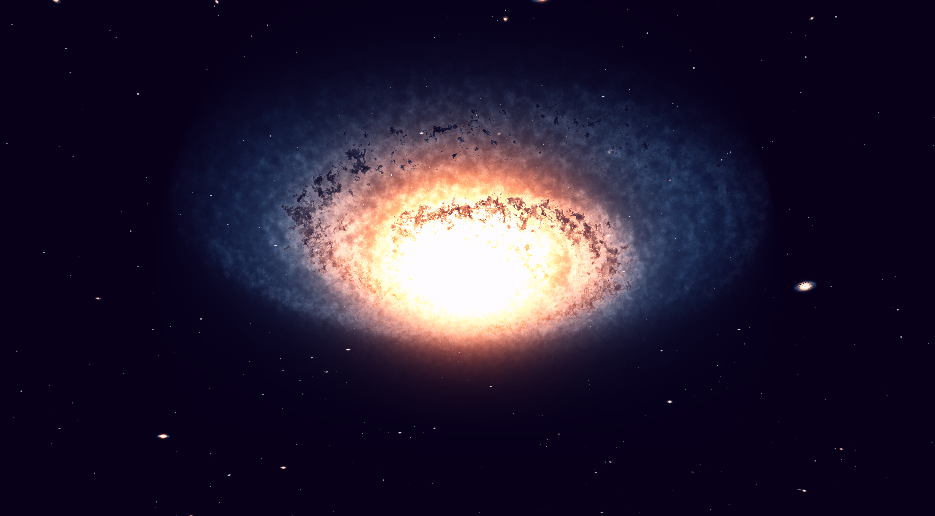
彩色方块通道
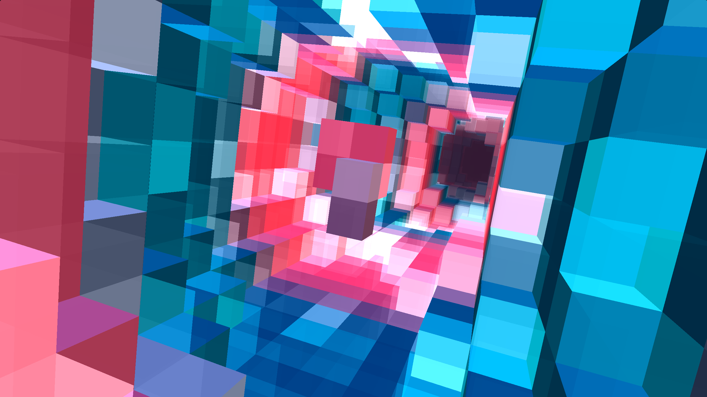

生长的蘑菇
https://www.shadertoy.com/view/3lGGWK
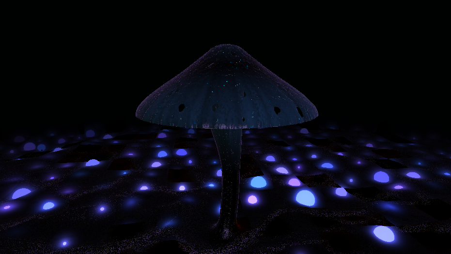
燕子
https://www.shadertoy.com/view/ssjXDt
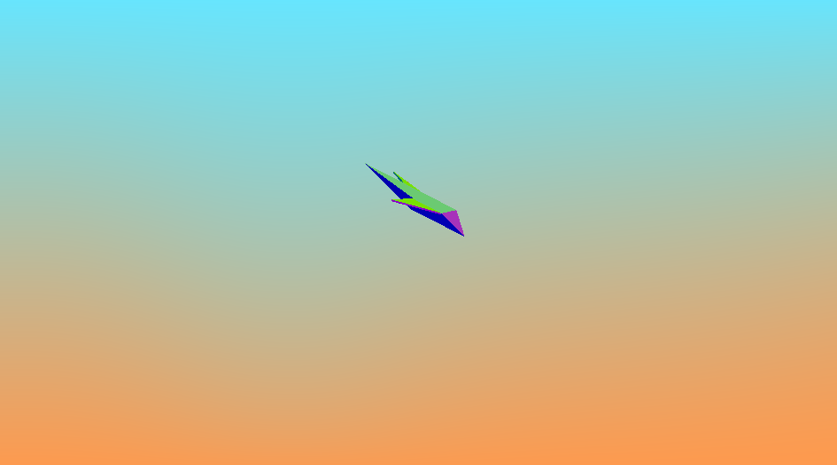
分形空间
https://www.shadertoy.com/view/WdGBz3
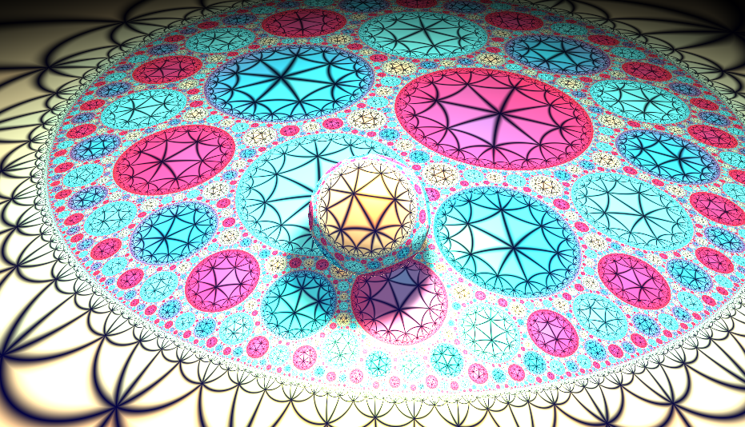
游动的鱼
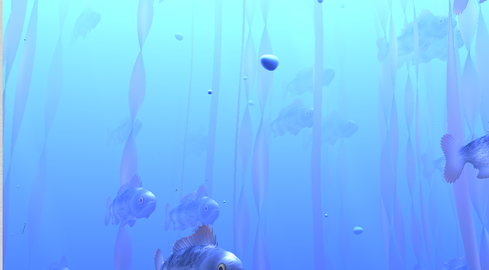
林锦
https://www.shadertoy.com/view/NtSGDc

铅笔画
https://www.shadertoy.com/view/ldXfRj

多彩鱼
https://www.shadertoy.com/view/4sGcWz
https://www.shadertoy.com/view/wsfXDS 多彩海底
https://www.shadertoy.com/view/fsG3WD 色块
https://www.shadertoy.com/view/XtsXRX 舞动的线条
https://www.shadertoy.com/view/7ljSzG 彩色发散标点话
https://www.shadertoy.com/view/WlsSzM 数字斜方块 //重要
https://www.shadertoy.com/view/wsKBW1 变化的彩色立体盒子
https://www.shadertoy.com/view/NsB3zG 赌运河船的彩色盒子
https://www.shadertoy.com/view/wtKBDD 油墨无限抛撒 //非常重要
https://www.shadertoy.com/view/fljGzd 光彩云
https://www.shadertoy.com/view/XdXGDS 香槟色 环绕
https://www.shadertoy.com/view/3s3cWr 油墨粒子混合
https://www.shadertoy.com/view/7dcGz2 像素圣物 \\互动重要
https://www.shadertoy.com/view/XdVcRW 多边形变色融合 
https://www.shadertoy.com/view/Wts3DB 多彩波浪线 //重要
https://www.shadertoy.com/view/ldccWj  菊花线变色//重要
https://www.shadertoy.com/view/4dBXWD cubemap 色彩球
https://www.shadertoy.com/view/3dl3Rn 色彩分析
https://www.shadertoy.com/view/7ld3WM  水晶发光体
https://www.shadertoy.com/view/ssKSWc 蓝紫条纹
https://www.shadertoy.com/view/wdtczM 星空无限
https://www.shadertoy.com/view/4lyyzc 色彩在水中的传播
https://www.shadertoy.com/view/NssGWj 点彩画
https://www.shadertoy.com/view/7dVXW3 3原色碰撞
https://www.shadertoy.com/view/XdtfW4 基本图形彩色重叠
https://www.shadertoy.com/view/sst3W8 色彩斑纹线中间渲染


# 视频或图片滤镜
https://www.shadertoy.com/view/tsV3Rw 彩铅画
https://www.shadertoy.com/view/7syXzR
https://www.shadertoy.com/view/fsK3zw 多彩
https://www.shadertoy.com/view/NddSRn 流动暗影路径
https://www.shadertoy.com/view/Ms23DR 旧电视
https://www.shadertoy.com/view/fscGWS 彩色圈圈
https://www.shadertoy.com/view/MlG3WG 勾轮廓
https://www.shadertoy.com/view/ldXGW4 信号受影响滤镜
https://www.shadertoy.com/view/ldjGzV
https://www.shadertoy.com/view/ldjGzV
https://www.shadertoy.com/view/XtcSRs 线波化视频或图片
https://www.shadertoy.com/view/MtKcDG 风格化视频 双视频 绿布视频
https://www.shadertoy.com/view/WtKfD3 视频模糊 控制
https://www.shadertoy.com/view/tdySW1 掉在泥巴上的控制
https://www.shadertoy.com/view/sddXWr 园圈像素化    
https://www.shadertoy.com/view/sdBSDW 大故障波纹
https://www.shadertoy.com/view/lldcR8 3D魔镜 镜中世界 //重要  //重要
https://www.shadertoy.com/view/sdtXzX 鼠标控制调整模糊值  //重要
https://www.shadertoy.com/view/tsdXDB 3D圆柱//重要
https://www.shadertoy.com/view/fstXWf 视频杂色
https://www.shadertoy.com/view/7scSRX 亮度提升 明暗变化
https://www.shadertoy.com/view/ftjSzd 混合滤镜
https://www.shadertoy.com/view/4dXBW2 抖动颜色
https://www.shadertoy.com/view/7d3XWH 彩色的抖动和晕色 //重要
https://www.shadertoy.com/view/4slGWn 一般的模糊
https://www.shadertoy.com/view/7d3XWH
https://www.shadertoy.com/view/XtlSzX 多重镜像
https://www.shadertoy.com/view/Mlj3Dw 白噪波
https://www.shadertoy.com/view/MllSR7 彩色上下条纹//重要
https://www.shadertoy.com/view/MtXXRf 黑白条纹 
https://www.shadertoy.com/view/XtSGRG 超彩色分割 //重要
https://www.shadertoy.com/view/Xl23WR 失真彩色
https://www.shadertoy.com/view/4ls3zs 线条化
https://www.shadertoy.com/view/XtBGDm 过曝
https://www.shadertoy.com/view/XdG3RR 对称加条纹 //音乐互动
https://www.shadertoy.com/view/lssyWH 视频加宽及鼠标互动  //非常重要 https://www.shadertoy.com/view/XdG3zw 同源加了色彩扩散 https://www.shadertoy.com/view/XdSGD3
https://www.shadertoy.com/view/tsV3Rw 手绘化https://www.shadertoy.com/view/NltGDn
https://www.shadertoy.com/view/4slGRM 水
https://www.shadertoy.com/view/XsVBDR 去噪蓝
https://www.shadertoy.com/view/lsy3zh 多视频黄澡干涉


视频对称 //非常重要
https://www.shadertoy.com/view/XdcSDs 色彩饱和化
https://www.shadertoy.com/view/MscfRj 鳞片化 
https://www.shadertoy.com/view/WsB3Wy 三图过渡
https://www.shadertoy.com/view/MlSXDG 玻璃碎片化色块话 //重要//重要
https://www.shadertoy.com/view/4sKyz1 //重要
https://www.shadertoy.com/view/7lt3RH 自制随时间融合分裂的对称视频//重要
https://www.shadertoy.com/view/XdSGD3 倒置 对称融合 //重要
https://www.shadertoy.com/view/XdSGD3 对称融合
https://www.shadertoy.com/view/wd2XRD 波纹拉长扩散
https://www.shadertoy.com/view/ws2yWK 扩散变化
https://www.shadertoy.com/view/ws2yWK
https://www.shadertoy.com/view/3ss3RH 边缘4对称融合
https://www.shadertoy.com/view/XlcGWr 黑白去色对半分割
https://www.shadertoy.com/view/lly3zd
https://www.shadertoy.com/view/tdjBzy 黄白变化
https://www.shadertoy.com/view/llKcDR 规则多边形视频分割
https://www.shadertoy.com/view/MltyD8 彩色色散
https://www.shadertoy.com/view/ttjSDG 边缘对称融合
https://www.shadertoy.com/view/WlSXz3 超级扩散  //重要
https://www.shadertoy.com/view/Xs2XDK 颜色
https://www.shadertoy.com/view/3syGzw 视频颜色蛇化
https://www.shadertoy.com/view/Xs2XDK 视频倒置
https://www.shadertoy.com/view/XljyzV 视频波浪化
https://www.shadertoy.com/view/tscBDr 鼠标控制水平融合 //重要
https://www.shadertoy.com/view/WddyW8 模糊黑暗
https://www.shadertoy.com/view/3lyXDt 多维融合 //重要
https://www.shadertoy.com/view/7scSRX 黑白转化 
https://www.shadertoy.com/view/3dd3Wr 去噪
https://www.shadertoy.com/view/3dBGzt 无限细分加分形的格子
https://www.shadertoy.com/view/NlBXWR 两个视频/图 切分
https://www.shadertoy.com/view/7dy3W3 中间加光
https://www.shadertoy.com/view/fdl3Wj 圆点化 //重要
https://www.shadertoy.com/view/4s2GRR 折线彩条画 //重要

https://www.shadertoy.com/view/NlBXWK 电视效果 
https://www.shadertoy.com/view/XslBD2 视频镜像
https://www.shadertoy.com/view/3tKBzh 视频分形 //重要
https://www.shadertoy.com/view/3dVSWm 消减  双对称

https://www.shadertoy.com/view/MsfSW7 旋转角度融合
https://www.shadertoy.com/view/ldXXW7 对角度融合
 https://www.shadertoy.com/view/MsfXDM 斜对称融合 //重要 
https://www.shadertoy.com/view/tsd3RM 抖动条纹波浪融合
https://www.shadertoy.com/view/WlsfD7 光和色的空间 
https://www.shadertoy.com/view/MdtXWB 上下扭动的视频
https://www.shadertoy.com/view/WslyWn  多重切片画面 //非常重要
https://www.shadertoy.com/view/4dt3D4 分形融合 //重要

https://www.shadertoy.com/view/ldVBWc 多图
https://www.shadertoy.com/view/4lSfDh 对称变化融合
https://www.shadertoy.com/view/4ljcWK 线条画视频 、、重要 https://www.shadertoy.com/view/WslyDn
彩色花 https://www.shadertoy.com/view/4d2fDy
https://www.shadertoy.com/view/fscXW8 内卷 视频
https://www.shadertoy.com/view/fsyGWy 颜色非常虚化
https://www.shadertoy.com/view/fd3SW2 多个视频切分 鼠标控制
https://www.shadertoy.com/view/XdcGWf 虚化到黑场 //升仙
保证回收 可以做宣传视频
https://www.shadertoy.com/view/MdG3Dd 
彩带
https://www.shadertoy.com/view/NdK3R3
https://www.shadertoy.com/view/ldcyR4 //彩色线条

https://www.shadertoy.com/view/XlB3zV 互动的多彩线条 //重要
https://www.shadertoy.com/view/4t23Rc RGB震荡
https://www.shadertoy.com/view/MsKfRw 视频素描化
https://www.shadertoy.com/view/7sc3zB 半像素化
分形色彩绘画化视频图片 https://www.shadertoy.com/view/MdKXRy //非常重要
https://www.shadertoy.com/view/4dfGDH 图片清晰化 鼠标互动
https://www.shadertoy.com/view/slBXD1 视频 图片 晶片化 ////非常重要
https://www.shadertoy.com/view/4dfGDH 色彩化
https://www.shadertoy.com/view/ssX3D2 百叶窗点口
https://www.shadertoy.com/view/fsKGWt 视频调色 绿色
https://www.shadertoy.com/view/XdS3RW 多重格子颜色混合 //非常重要


# 3D音乐互动线条
https://www.shadertoy.com/view/lds3zr
https://www.shadertoy.com/view/4ljfWW 互动的阳光窗户 重要
https://www.shadertoy.com/view/7dV3DW 互动的分形彩盒
https://www.shadertoy.com/view/Ns3SRN 互动的彩粉
https://www.shadertoy.com/view/MslGRn 变幻的电元素  重要
https://www.shadertoy.com/view/4sjfzm 彩色螺旋
https://www.shadertoy.com/view/4tfBRf 互动的魔戒
https://www.shadertoy.com/view/XllcR4 音乐3影响互动
https://www.shadertoy.com/view/XdG3Wc 音乐互动屏幕 重要
https://www.shadertoy.com/view/Ndy3Dw 城市穿梭
https://www.shadertoy.com/view/4tXcRl 异域深坑穿梭
https://www.shadertoy.com/view/MdSXzG 红眼互动
https://www.shadertoy.com/view/3s2BzV 3个比赛的球
https://www.shadertoy.com/view/tlX3zB 内卷城市 卡点
https://www.shadertoy.com/view/ldBGWW 互动的魔眼
https://www.shadertoy.com/view/NlsXDH 数字世界移动的光立方
https://www.shadertoy.com/view/tsScRK 音乐互动环境
https://www.shadertoy.com/view/wly3Dy 互动星系
https://www.shadertoy.com/view/XtdSDn 互动的线条水滴
https://www.shadertoy.com/view/MtKSRc 互动立方块堆 //重要//重要
https://www.shadertoy.com/view/ltyGRV 视频材质 波纹3者换 互动//重要
https://www.shadertoy.com/view/fsKGzd 感应彩色线条 声音层  //重要
https://www.shadertoy.com/view/XtK3W3 画面抖动
https://www.shadertoy.com/view/fsG3zd 鼠标速度互动
https://www.shadertoy.com/view/ldKyWV 音乐互动的 多个球
https://www.shadertoy.com/view/MsdGz2 音乐互动沙地 怪兽
https://www.shadertoy.com/view/XdSGDc 互动的音乐停车场
https://www.shadertoy.com/view/Xl2SRR 星星 烟花
https://www.shadertoy.com/view/MtXczn
https://www.shadertoy.com/view/wdlfWj 超级互动的彩色空间
https://www.shadertoy.com/view/XstGDf 互动 光
https://www.shadertoy.com/view/XttcD4 互动的一根彩色线条
https://www.shadertoy.com/view/3dK3zt 互动的幽灵鬼 //重要
https://www.shadertoy.com/view/3dlXRj 中心互动的花朵
https://www.shadertoy.com/view/7dB3Rz 多彩线条加欢
https://www.shadertoy.com/view/wdfBRj 超级音乐互动场景 //非常重要
https://www.shadertoy.com/view/wdsBR4 色散的3D异形空间
https://www.shadertoy.com/view/4l3Szs 鼠标互动 魔法球
https://www.shadertoy.com/view/td2BRc 凯通外星人互动 
https://www.shadertoy.com/view/wsGyWm 音乐层 波动 //重要
https://www.shadertoy.com/view/fdj3RW 互动的圈圈
https://www.shadertoy.com/view/MdVBzR 互动的VR画画
https://www.shadertoy.com/view/wsscD8 鼠标点击 避免分形
https://www.shadertoy.com/view/4llfDs 全互动的音乐水立方
https://www.shadertoy.com/view/sscGR8 互动的传输管道
https://www.shadertoy.com/view/fsK3RD 互动色环
https://www.shadertoy.com/view/4llBD8 土星及光环
https://www.shadertoy.com/view/4tySDW 互动粒子块
https://www.shadertoy.com/view/XlfXzM 互动的彩色球
https://www.shadertoy.com/view/wdGcRK 发光的栅栏
https://www.shadertoy.com/view/tstSz7 互动的键盘
https://www.shadertoy.com/view/lslfR7 2音乐轨互动
https://www.shadertoy.com/view/fsK3RD 彩色光圈互动
https://www.shadertoy.com/view/MsdyW2 音乐互动的Cube反射球
https://www.shadertoy.com/view/NdB3zK 飞船穿梭金属网格
https://www.shadertoy.com/view/MsKXDw 互动音乐分形

飞船运动
https://www.shadertoy.com/view/ltfGDs
根须彩色
https://www.shadertoy.com/view/flBSzw
彩色发光的龙猫尾巴
https://www.shadertoy.com/view/sdKGWt

生物黑洞
https://www.shadertoy.com/view/4slyRs
像素线路板
https://www.shadertoy.com/view/ssjGWW
黑色油滴
https://www.shadertoy.com/view/sstSW8

龙的眼睛
https://www.shadertoy.com/view/NlSSDG
钻石山
https://www.shadertoy.com/view/ltKGzc
跳舞的数字人
https://www.shadertoy.com/view/XdB3Dw
光路
https://www.shadertoy.com/view/flBXzd
酒杯静物3D
https://www.shadertoy.com/view/XtyGWD
线性围绕运动的心形
https://www.shadertoy.com/view/WdK3Dz
细胞变化
https://www.shadertoy.com/view/fdyGDG
流动彩光的影响
https://www.shadertoy.com/view/MdSczK


# 3D材质球展示
https://www.shadertoy.com/view/7dcSWB
https://www.shadertoy.com/view/MdyfWw 彩色材质球
https://www.shadertoy.com/view/7dS3Wh 场景
https://www.shadertoy.com/view/ld3SRr 特殊材质球
https://www.shadertoy.com/view/4tyXDR 蓝色旋转的玻璃球
https://www.shadertoy.com/view/tlSSDV 机械手加很多球
https://www.shadertoy.com/view/MdjXzG 黄金材质环绕
https://www.shadertoy.com/view/3scfD7 海水
https://www.shadertoy.com/view/XsB3Rm
https://www.shadertoy.com/view/Ndt3Dn 4个材质球
https://www.shadertoy.com/view/llcyR7 1个动漫材质球
https://www.shadertoy.com/view/7sV3Rh 泡泡材质的各种体 //重要
https://www.shadertoy.com/view/ldcBzX 9材质球
https://www.shadertoy.com/view/XsGfWt 发光眼睛
https://www.shadertoy.com/view/ld3SDl 泡啊泡  //重要 //重要
https://www.shadertoy.com/view/XdfGz8 燃烧球
https://www.shadertoy.com/view/lsBfRc 光晕
https://www.shadertoy.com/view/MstXWS 材质不断变色及生存的材质球 //重要
https://www.shadertoy.com/view/XsfBRH 血红球
https://www.shadertoy.com/view/Xljcz1 发散的塑料球 https://www.shadertoy.com/view/XlfyWl
https://www.shadertoy.com/view/7lBSWV 水的融合变化
https://www.shadertoy.com/view/Xt3SR4 可控的云彩
https://www.shadertoy.com/view/MtycDD 光源材质球
https://www.shadertoy.com/view/4sS3zc 泡珠子球
https://www.shadertoy.com/view/4l23DD 水元素 //非常重要 https://www.shadertoy.com/view/4t2SWW
https://www.shadertoy.com/view/MlVGRt 金元素 //非常重要
https://www.shadertoy.com/view/sld3RH 七彩元素球 //非常重要
https://www.shadertoy.com/view/XsSGDh 七彩元素球 园
https://www.shadertoy.com/view/WtfGWH 无限镜中世界
https://www.shadertoy.com/view/XtdGRl 雾球
https://www.shadertoy.com/view/lsdcWN 融合的园
https://www.shadertoy.com/view/Wt3XRN 玻璃球及环境
https://www.shadertoy.com/view/ftB3DG  多材质的超级四方体   ..重要
https://www.shadertoy.com/view/3s2fRG 变化的材质球
https://www.shadertoy.com/view/tstGWr 发光的 和透明反射体
https://www.shadertoy.com/view/3ltGDH 土元素 //重要
https://www.shadertoy.com/view/wttczM 彩色珠子球
https://www.shadertoy.com/view/tdjGR1 红绿球
https://www.shadertoy.com/view/fs23Dy 光的方盒子
https://www.shadertoy.com/view/wstBRB 闪电元素球 //非常重要
https://www.shadertoy.com/view/ldXczX 球的不断拟态接近
https://www.shadertoy.com/view/Mss3WN 脑的材质
https://www.shadertoy.com/view/XlGcRh 分化噪点
https://www.shadertoy.com/view/Ns33DX 旋转的方体
https://www.shadertoy.com/view/tsVGRd 材质分割调试
https://www.shadertoy.com/view/3tjczm 变化的木头 木元素//非常重要
https://www.shadertoy.com/view/MssGW4 绒毛 卷一起
https://www.shadertoy.com/view/Mdl3z2 水
https://www.shadertoy.com/view/MdjBDh 雨水滴落
https://www.shadertoy.com/view/ll3GRM 血
https://www.shadertoy.com/view/ssVXzD 会呼吸的球
https://www.shadertoy.com/view/XlXGWf 3色立方体
室内球
https://www.shadertoy.com/view/XstBzM https://www.shadertoy.com/view/NdGGRK  3D齿轮 https://www.shadertoy.com/view/ltj3zW 一个球的光影变化
https://www.shadertoy.com/view/lsGGDd
3D阵列
https://www.shadertoy.com/view/tdB3zV 
水熊虫
https://www.shadertoy.com/view/ldcyW4
变色球
https://www.shadertoy.com/view/XdS3Rt
动画
https://www.shadertoy.com/view/WtfGWn
https://www.shadertoy.com/view/3ddXR4 骷髅3D
3D海上飞机
https://www.shadertoy.com/view/fdy3DW
https://www.shadertoy.com/view/sscSW2 Smoldering 

https://www.shadertoy.com/view/NsV3Wz 气也太的色彩
https://www.shadertoy.com/view/fdG3zV 气液态的色彩

https://www.shadertoy.com/view/WtXfDs GAN脸
https://www.shadertoy.com/view/3syXzt 数字图形聚合合成

https://www.shadertoy.com/view/llXBDH 多维坐标空间

https://www.shadertoy.com/view/Xsd3zf 雪花加冰材质
https://www.shadertoy.com/view/XsB3Wc 多彩云材质球
https://www.shadertoy.com/view/XljBW3 立体数据流
https://www.shadertoy.com/view/7dVGRR 3D分形魔方
https://www.shadertoy.com/view/fljSW1 3D植物
https://www.shadertoy.com/view/ss3XWN 虚空剑变化
https://www.shadertoy.com/view/7tfSzB 分形3D空间
https://www.shadertoy.com/view/XlcSzM 俄罗斯套娃无限
https://www.shadertoy.com/view/fdfSDH 无限变幻的4D体
https://www.shadertoy.com/view/MdyGzR 3体 星系
https://www.shadertoy.com/view/sscXzl 像素地球+光照
https://www.shadertoy.com/view/MsSGD1 卡通3D可控动画
https://www.shadertoy.com/view/7ddGzS 风
https://www.shadertoy.com/view/NdcXDM 3D不同立体变幻
https://www.shadertoy.com/view/Mdf3zM 艾歇尔建筑
https://www.shadertoy.com/view/Mdl3Rr 室内逛
https://www.shadertoy.com/view/ttVfDc 彩色烟雾
https://www.shadertoy.com/view/sst3Ws 无限上楼梯
https://www.shadertoy.com/view/MsG3Dz 无限珠子反射
https://www.shadertoy.com/view/llGGz3 抽象化
https://www.shadertoy.com/view/WtGBDG 云
https://www.shadertoy.com/view/tltXWM 气态星球
https://www.shadertoy.com/view/XlSSzK 光的地带 //重要 https://www.shadertoy.com/view/XdlGzH
https://www.shadertoy.com/view/fllGR7 光蛇
https://www.shadertoy.com/view/MsGBz3 多星环绕
https://www.shadertoy.com/view/MlfcR2 海边高塔
https://www.shadertoy.com/view/st2GRd 6边光立方
https://www.shadertoy.com/view/tlGBW1 4个细胞培养皿 //重要
https://www.shadertoy.com/view/st2GRd 发光六面体
https://www.shadertoy.com/view/ftSXDV 平衡迷宫游戏  自动生成迷宫 //重要
https://www.shadertoy.com/view/7sKSW1 变化的多边形
https://www.shadertoy.com/view/Xsd3DB 水波纹 鼠标控制
https://www.shadertoy.com/user/jialouluo 中文解析 、、重要
https://www.shadertoy.com/view/XdyyDV 超大型城市 //重要 https://www.shadertoy.com/view/wsGBzV
https://www.shadertoy.com/view/NdKGDw 3D立体火焰
https://www.shadertoy.com/view/fscXR8 分形透视立体空间
https://www.shadertoy.com/view/3slyRX 宇宙飞船穿梭 //重要
https://www.shadertoy.com/view/XsyGzz 彩色线条
https://www.shadertoy.com/view/sljXDz 车间流水山的卡牌
https://www.shadertoy.com/view/fd3GD8 PX下雪
https://www.shadertoy.com/view/ttscWn 分形旋转盘
https://www.shadertoy.com/view/WljSWz 收腐蚀的头像 、、重要
https://www.shadertoy.com/view/7lXXWX 上下滚蛋的油井平台
https://www.shadertoy.com/view/sdt3Dl 宝石的框架坐标
https://www.shadertoy.com/view/sdt3R7 简单的机械三视图
https://www.shadertoy.com/view/XtSGDK 4维囚牢
https://www.shadertoy.com/view/MljXDw 球状云
https://www.shadertoy.com/view/llGSzw hash 彩色点源码
https://www.shadertoy.com/view/tdGGRh 太空器补做球
https://www.shadertoy.com/view/Nsy3zG 雷神的金属锤子 //重要
https://www.shadertoy.com/view/fsy3Dy 彩色4维方盒旋转
https://www.shadertoy.com/view/Nsd3zn 简单图形 可做SVG的基本形态 //重要
https://www.shadertoy.com/view/fl2SDV 无限迷宫
https://www.shadertoy.com/view/3sBGRt 异域废墟
https://www.shadertoy.com/view/4djBDR 通道测试加光线跳动
https://www.shadertoy.com/view/4tBXR1 3D蘑菇   
https://www.shadertoy.com/view/stlSW4 笑笑园填充
https://www.shadertoy.com/view/llB3zG 变幻的包裹光的3D球 //重要
https://www.shadertoy.com/view/NlXGDX 变幻的光彩的3D球  //重要


·······················
https://www.shadertoy.com/view/3sffzj 云
https://www.shadertoy.com/view/ll2BzR 两只海鸥环绕的船
https://www.shadertoy.com/view/MscXWX 蜘蛛爬行的莫比乌苏环
https://www.shadertoy.com/view/XsGXR1 缠绕的莫比乌斯环
https://www.shadertoy.com/view/3dSXzm 黑色物资穿梭的管道
https://www.shadertoy.com/view/llS3RK 流动的细胞
https://www.shadertoy.com/view/3dBSDW 日出日落
https://www.shadertoy.com/view/7dcGWX 螺旋结构
https://www.shadertoy.com/view/fsG3zR 渐变色的药剂
https://www.shadertoy.com/view/NsVGWG 燕子变幻
https://www.shadertoy.com/view/4lBGRh 空间站
https://www.shadertoy.com/view/sscSDr 分形变化内卷
https://www.shadertoy.com/view/4ssGzn 云汉
https://www.shadertoy.com/view/3tccWf 六角林竹
https://www.shadertoy.com/view/Xs2SWd 旋涡绿
https://www.shadertoy.com/view/lss3WS 光穿梭
https://www.shadertoy.com/view/Xd3SDs 玻璃体穿梭
https://www.shadertoy.com/view/4ljXWh 水底环境 重要
https://www.shadertoy.com/view/stjSDh 弹珠和环
https://www.shadertoy.com/view/sdtGRM 空间体
https://www.shadertoy.com/view/Ws3yW4 3D立体动漫人
https://www.shadertoy.com/view/wd2yRm 线性切割4分图
https://www.shadertoy.com/view/ttVSDW pixl分形
https://www.shadertoy.com/view/3t3Bzj 光流旋涡
https://www.shadertoy.com/view/fdcSWS 粒子发生器
https://www.shadertoy.com/view/slSSzt 光发散实验
https://www.shadertoy.com/view/sdsXWr 钟摆
https://www.shadertoy.com/view/3dsSWs 变化的棋盘
https://www.shadertoy.com/view/MdGGRW 大型发光粒子
https://www.shadertoy.com/view/7lf3Wn 色彩坐标
https://www.shadertoy.com/view/XdX3WN 变化的三原色坐标
https://www.shadertoy.com/view/Nds3W7 航信的小海盗船
https://www.shadertoy.com/view/sdd3Dr 黑云围绕发光
https://www.shadertoy.com/view/stjSzc 图层变幻
https://www.shadertoy.com/view/7dyGDh 滚动的传动器
https://www.shadertoy.com/view/tlV3zy 独眼的3只怪兽
https://www.shadertoy.com/view/7dVGRW 彩色方块
https://www.shadertoy.com/view/4lVGRy 地球地球 太空四角 
https://www.shadertoy.com/view/llj3zV 球 太空四角
https://www.shadertoy.com/view/7s3XD8 分形彩色
https://www.shadertoy.com/view/stSXzm 2个玻璃珠的光环境
https://www.shadertoy.com/view/3d3fRB 3个球的烟雾
https://www.shadertoy.com/view/3ddfDj 大象模型
https://www.shadertoy.com/view/ldSBD3 
https://www.shadertoy.com/view/sdy3Dd 快的闪动 
https://www.shadertoy.com/view/Ndd3D7 像素点测试
https://www.shadertoy.com/view/3sSGRz 光球模拟光线
https://www.shadertoy.com/view/tl2fDc 3隔断混沌
https://www.shadertoy.com/view/WtSfRy 2条缠绕的线条
https://www.shadertoy.com/view/wscSzX 分形扩散面
https://www.shadertoy.com/view/Mtf3zr 变化的四位坐标
https://www.shadertoy.com/view/Wlc3Wj 海面及其倒影
https://www.shadertoy.com/view/3tXXDl 对称图
https://www.shadertoy.com/view/llf3zS 立体的光电游动场
https://www.shadertoy.com/view/wlScWD 明暗变化的方块
https://www.shadertoy.com/view/lssSRS 模糊放大镜

https://www.shadertoy.com/view/WdKXDt 对称雪花+

https://www.shadertoy.com/view/MsGfzD 鹿角分形体
https://www.shadertoy.com/view/MsjSWy CSF间隔光照
https://www.shadertoy.com/view/Xlj3zc 分形无限
https://www.shadertoy.com/view/NtXSDj 分形创建
https://www.shadertoy.com/view/3tjczt 扩散
https://www.shadertoy.com/view/sdV3DW  颜色色散 加流亭
https://www.shadertoy.com/view/sdVXWz 颜色及线条世界
https://www.shadertoy.com/view/XscyRs Q糖宝贝
https://www.shadertoy.com/view/ltBXRc 彩色流动变化环
https://www.shadertoy.com/view/3sVBDd 跳动的方块色子
https://www.shadertoy.com/view/Wl2yWm 发光的光稻穗
https://www.shadertoy.com/view/MdlXD4 3D瀑布
https://www.shadertoy.com/view/ftjXRD 3D分形空间
https://www.shadertoy.com/view/XlcfRs 3D分形空间加背景
https://www.shadertoy.com/view/XsjGRd 地球
https://www.shadertoy.com/view/tt3SWB 电的空间
https://www.shadertoy.com/view/4ttXzj
https://www.shadertoy.com/view/XssczX 莫比乌斯环 加蚂蚁
https://www.shadertoy.com/view/3dyXzD 建筑类
https://www.shadertoy.com/view/fsKGDK 简单3D分形
https://www.shadertoy.com/view/lsyXDK 恒星爆炸 
https://www.shadertoy.com/view/NtBSz3 跳舞坐标
https://www.shadertoy.com/view/ltKSWD ai线拟合
https://www.shadertoy.com/view/fsc3WM 发光的面
https://www.shadertoy.com/view/4sfGRH 动态视频
https://www.shadertoy.com/view/ftsSRn 分形 扫描线
https://www.shadertoy.com/view/wdBGDh 跳动的标志小人
https://www.shadertoy.com/view/Ndt3Wl 解连环
https://www.shadertoy.com/view/NdV3Dw 珠子坠落
https://www.shadertoy.com/view/WscyWB 闪电
https://www.shadertoy.com/view/ldGcDh 盒子空间
https://www.shadertoy.com/view/wdGcRK 地图生成 白黑绿
https://www.shadertoy.com/view/NstSzX 紫色太阳
https://www.shadertoy.com/view/sdV3zh 水波纹线
https://www.shadertoy.com/view/MtBfWw 变形的阵列正方形
https://www.shadertoy.com/view/Xdt3DB 绿色发光线条
https://www.shadertoy.com/view/MldfD7 四分割线条变化
https://www.shadertoy.com/view/sd3Gz7 毛玻璃化的色彩块
https://www.shadertoy.com/view/llj3zV 气态星球
https://www.shadertoy.com/view/stsSWf 光线 透镜实验室


# 3D模型代码及环境
https://www.shadertoy.com/view/sd33zN 兔子模型
https://www.shadertoy.com/view/lldyWn 婴儿
https://www.shadertoy.com/view/fsdXz7 猴子头
https://www.shadertoy.com/view/XldSDs 金属螺旋
https://www.shadertoy.com/view/4dlGD7 花朵
https://www.shadertoy.com/view/7sy3Ry 基本语法  重要
https://www.shadertoy.com/view/MlcBDj 特殊版型基本体
https://www.shadertoy.com/view/NsSSDW 金属交织空间
https://www.shadertoy.com/view/tdjfDR 马斯克空间环境
https://www.shadertoy.com/view/NdGGD3 赌马盅 
https://www.shadertoy.com/view/MlyyzW 金表和铅笔
https://www.shadertoy.com/view/7ssXWl 分形体
https://www.shadertoy.com/view/4lcyD8 人模型
https://www.shadertoy.com/view/Nd3SRn 被开孔的球
https://www.shadertoy.com/view/tdXBW8 霓虹世界
https://www.shadertoy.com/view/Ms2GDV 异形螺旋体
https://www.shadertoy.com/view/Mlf3R4 球变化成分形体
https://www.shadertoy.com/view/WlfXRr 一组发光体
https://www.shadertoy.com/view/3tVSRh 分形体
https://www.shadertoy.com/view/4sf3Dj G 3dshuzi
https://www.shadertoy.com/view/wtsGzl 雪花三椎
https://www.shadertoy.com/view/XltyRf 3D外星人改造地球 视频，音乐互动 //重要
https://www.shadertoy.com/view/ttXfWs 3D立体环境
https://www.shadertoy.com/view/ssKSWc 线条色环境
https://www.shadertoy.com/view/7dy3Rc 能互动分裂的5个球
https://www.shadertoy.com/view/WllSDM 光栅推进环境
https://www.shadertoy.com/view/ltfXDM 钻石体 //重要
https://www.shadertoy.com/view/Xt23z3 流线社体
https://www.shadertoy.com/view/Ndt3zS 2个光源的测试环境 ///重要
https://www.shadertoy.com/view/wl2SDt 分形变化体
https://www.shadertoy.com/view/wlSBzD 光谱
https://www.shadertoy.com/view/fs33Rr 光柱
https://www.shadertoy.com/view/WtB3Wt 变化的体
https://www.shadertoy.com/view/NsS3Rw 屏幕扫描线测试
https://www.shadertoy.com/view/wlBcWc 玻璃材质和酒杯
https://www.shadertoy.com/view/wdKBz1 车厢
https://www.shadertoy.com/view/XlycWh 球反射
https://www.shadertoy.com/view/4lyfzw 复合体 体的运算
https://www.shadertoy.com/view/Msl3WH 穿梭黑暗
https://www.shadertoy.com/view/ftBSWd 萤火虫 //重要
https://www.shadertoy.com/view/4tdSDX 冰山
https://www.shadertoy.com/view/4dfXWj 马里奥 独立声音图层//重要
https://www.shadertoy.com/view/4ddfWX 黑暗球悬浮 独立声音图层//重要
https://www.shadertoy.com/view/NtBXWV 黑洞变幻
https://www.shadertoy.com/view/tdBGWD 光和湖的环境
https://www.shadertoy.com/view/NlB3Rc 荡漾的图片
https://www.shadertoy.com/view/lslfRN 山林环境
https://www.shadertoy.com/view/ll2SWd 云层之山
https://www.shadertoy.com/view/4l2XWh 海和太阳 独立音乐层
https://www.shadertoy.com/view/4sSXWt 光的不同渲染方式
https://www.shadertoy.com/view/fl2XDR HDR下的云
https://www.shadertoy.com/view/lsfXWH 小装置模型
https://www.shadertoy.com/view/7td3zn 3D动态盒子
https://www.shadertoy.com/view/7ld3zr 化学线条
https://www.shadertoy.com/view/NdVXWy 线管
https://www.shadertoy.com/view/ldl3zl 厨房里的小模型
https://www.shadertoy.com/view/7scGWn 分形四分体
https://www.shadertoy.com/view/wtf3RM 流行的人体及球形
https://www.shadertoy.com/view/NsKGzD 分形生成
https://www.shadertoy.com/view/wlj3zV 在线条里移动的黑体
https://www.shadertoy.com/view/ftl3zN 飞动的云朵
https://www.shadertoy.com/view/MsXyzN 冰环境
https://www.shadertoy.com/view/ftjSWy 多凌住环境
https://www.shadertoy.com/view/wtGfRy 分形的彩色环境
https://www.shadertoy.com/view/4d3fzN 黑色昏暗环境
https://www.shadertoy.com/view/Nst3zj 五星照明
https://www.shadertoy.com/view/4tVXRV 分形3D 太空
https://www.shadertoy.com/view/WtjGRc 天空 地面
https://www.shadertoy.com/view/Xd3fR7 桂林山水
https://www.shadertoy.com/view/7dGXRw 3D彩色球
https://www.shadertoy.com/view/MdKyRw 分形
https://www.shadertoy.com/view/Wt3XRX 分形3D
https://www.shadertoy.com/view/7sG3zD 彩色摇
https://www.shadertoy.com/view/Mt2yzK 吴起
https://www.shadertoy.com/view/3ddfDj 大象
https://www.shadertoy.com/view/3d3fRB 烟雾环境
https://www.shadertoy.com/view/MlGcDz 三角形
https://www.shadertoy.com/view/4tscR8 飞船追逐
https://www.shadertoy.com/view/fdy3RG 4面体
https://www.shadertoy.com/view/4ljfzw 玻璃船
https://www.shadertoy.com/view/lsjczK 球加圆环
https://www.shadertoy.com/view/XtfXWB 子弹时间
https://www.shadertoy.com/view/MsjcWm 分形清晰放大镜 //重要
https://www.shadertoy.com/view/WlSfDm 三个发光精子
https://www.shadertoy.com/view/Mt2czK 自己移动的镜子世界
https://www.shadertoy.com/view/ttsfRH 飞舞的镜子加电音世界
https://www.shadertoy.com/view/3tl3Rl 彩色金属球环绕镜子世界
https://www.shadertoy.com/view/WsBGRz 光通过宁静的模拟
https://www.shadertoy.com/view/XdX3zs  多个玻璃珠的玻璃反射盒子 重要
https://www.shadertoy.com/view/llXSWr 小丑玩3个玻璃球
https://www.shadertoy.com/view/wdfXWX 丝网材质球旋转
https://www.shadertoy.com/view/wdt3Dj 光和球的对碰融合
https://www.shadertoy.com/view/WtGcDd 运动的对称体
https://www.shadertoy.com/view/3tVcWV 空间4维体
https://www.shadertoy.com/view/Xs3SzM 光环境跳舞的2个球
https://www.shadertoy.com/view/NdsSDS 变化的环 //键盘控制  重要
https://www.shadertoy.com/view/wtVcDd 茶盘
https://www.shadertoy.com/view/3dyBzD 玻璃对称环境
https://www.shadertoy.com/view/MdfGzj 一群彩色珠子环绕
https://www.shadertoy.com/view/Wd2fRG 变化的六边体
https://www.shadertoy.com/view/3sdXRf 玻璃房间
https://www.shadertoy.com/view/tstGWr 发光的
https://www.shadertoy.com/view/ssK3DR 海边的星星
https://www.shadertoy.com/view/XsdSRs 彩色材质空间
https://www.shadertoy.com/view/Mtc3W8 阵列的彩色球
https://www.shadertoy.com/view/4dfcR4 彩色矩阵
https://www.shadertoy.com/view/3tSyWG 螺旋体
https://www.shadertoy.com/view/7sfXz4 3球反射空间
https://www.shadertoy.com/view/7tjSRd 钱的世界
https://www.shadertoy.com/view/sdG3Wc 扫描线
https://www.shadertoy.com/view/4tKBWy  自动生长 消失的木块 //重要
https://www.shadertoy.com/view/fdSGzt 立体分层 分形  //重要
https://www.shadertoy.com/view/fscGzX 星星闪耀
https://www.shadertoy.com/view/7tXXDH 3D紫色火焰
https://www.shadertoy.com/view/NlXXDj 
https://www.shadertoy.com/view/sls3Ds 建筑玻璃
https://www.shadertoy.com/view/ltB3DG 粒子空间
https://www.shadertoy.com/view/NlBSWy 粒子盒子空间 
https://www.shadertoy.com/view/3t3SD8 几何体组合
https://www.shadertoy.com/view/MlSXzG 血环境
https://www.shadertoy.com/view/sdtXz4 钻石空间
https://www.shadertoy.com/view/sddGR8 变化的盒体
https://www.shadertoy.com/view/fs33DM 随机的工厂齿轮
https://www.shadertoy.com/view/ssyXR3 环状 LOGO的变体
https://www.shadertoy.com/view/Mt3BDj 被倒角的基本体
https://www.shadertoy.com/view/XlSBRW 无限收缩的实体
https://www.shadertoy.com/view/4t3BWl 数字森林
https://www.shadertoy.com/view/XsfSR8 毛绒
https://www.shadertoy.com/view/7d3GRX 不断翻滚的
https://www.shadertoy.com/view/7dc3D8 无限套装的数字齿轮
https://www.shadertoy.com/view/7sc3RS 火
https://www.shadertoy.com/view/fl2XDd 球传输的场景
https://www.shadertoy.com/view/XlBXWw 无限血放大
https://www.shadertoy.com/view/Msd3DN 飞机发礼物
https://www.shadertoy.com/view/lsSGRc 变化的木方块
https://www.shadertoy.com/view/Nl2XRm 闪动的分形空间
https://www.shadertoy.com/view/7dV3zt 外形空间
https://www.shadertoy.com/view/7tBGz1 图扩展
https://www.shadertoy.com/view/WdBGDm 水滴扩散 可互动 1//重要
https://www.shadertoy.com/view/wl3fDl 舞动的腿和球 声音层//重要
https://www.shadertoy.com/view/ldccW4 黑客帝国 数字流 //重要
https://www.shadertoy.com/view/Nlc3RM
https://www.shadertoy.com/view/fsGGRy 波场
https://www.shadertoy.com/view/Nd3SRS 数字化
https://www.shadertoy.com/view/NddGzn 旋转贴片灯带
https://www.shadertoy.com/view/ssdGWl 无限下滚的球
https://www.shadertoy.com/view/NsBXzG 红色变化的分形立方
https://www.shadertoy.com/view/sdyGDy 3D影院
https://www.shadertoy.com/view/wdSGRG 分形六面体
https://www.shadertoy.com/view/MtKSWW 闪电和金属空间
https://www.shadertoy.com/view/4djfWt 滚动的红色立方 无限穿梭
https://www.shadertoy.com/view/lsfXz4 无限滚动的球
https://www.shadertoy.com/view/4ldGRf 云自动 生成
https://www.shadertoy.com/view/Xls3z2 分形金属接
https://www.shadertoy.com/view/lttBDB 分形球植物生长
https://www.shadertoy.com/view/Ms33WB 纯白空间
https://www.shadertoy.com/view/WlBXW3 卡通动漫
https://www.shadertoy.com/view/Mss3R8 分形
https://www.shadertoy.com/view/fdd3Wj 穿梭石块阵
https://www.shadertoy.com/view/ldByDh 蘑菇世界 重要
https://www.shadertoy.com/view/wlyyWD 水滴融合
http://www.shadertoy.com/view/ttyGzW 无限循环的分形
https://www.shadertoy.com/view/llffWs 三分格 看抗锯齿和Filtered checker 
https://www.shadertoy.com/view/Nd3SRS 分形杂色化
https://www.shadertoy.com/view/ldycW3  无限变化的多变体
https://www.shadertoy.com/view/ftSXDR 金属球滚动的KTV空间
https://www.shadertoy.com/view/3tsfRM 卡通世界
https://www.shadertoy.com/view/XsG3z1 红色水质环境
https://www.shadertoy.com/view/Msf3z4 3D cubemap环境 //非常重要
https://www.shadertoy.com/view/tsGXWm 3D穿梭 cubemap环境
https://www.shadertoy.com/view/wdfGzr 圣诞树 https://www.shadertoy.com/view/Wt33zS
https://www.shadertoy.com/view/ls2cz3 3D cubemap环境  贴图13通道正常  //非常重要
https://www.shadertoy.com/view/tdGXRc 人头
https://www.shadertoy.com/view/4t3yzj cubemap环境作为球的贴图
https://www.shadertoy.com/view/ls3GWj 云天空间cubemap环境
https://www.shadertoy.com/view/ldKSDm 异形可控
https://www.shadertoy.com/view/lsVXWh 3D cubemap环境  贴图1通道 //重要
https://www.shadertoy.com/view/4tsXzn 水上的球
https://www.shadertoy.com/view/lttBDB 自由生长的花 //重要
https://www.shadertoy.com/view/sst3Rn 像素图案生成
https://www.shadertoy.com/view/3tfcRS 旋转的瓶子 //重要
https://www.shadertoy.com/view/slBXD1 自动俄罗斯方块
https://www.shadertoy.com/view/4t2SWW 变化的油菜墨滴
https://www.shadertoy.com/view/ftsGz2 玻璃变化环境
https://www.shadertoy.com/view/MsXGz4 多珠子cubemap变化 
https://www.shadertoy.com/view/4d2yRt 光 穿梭的隧道
https://www.shadertoy.com/view/3d2SWK 蝶形黑洞
https://www.shadertoy.com/view/4tc3WB Q版发菜发型
https://www.shadertoy.com/view/7s3GDf 机器人
https://www.shadertoy.com/view/WlVcWK 珠子海洋
https://www.shadertoy.com/view/4tB3zV 火的环境
https://www.shadertoy.com/view/3ty3Dy 离子化海洋
https://www.shadertoy.com/view/Mt3GW2 管隧道
https://www.shadertoy.com/view/fdB3RW 2个光源对材质球的影响
高铁运动 回访运动 https://www.shadertoy.com/view/4s2Sz3
https://www.shadertoy.com/view/4ssSRX 木纹生长 图片可替换
https://www.shadertoy.com/view/WdlGRf 分形 多彩色
https://www.shadertoy.com/view/tt2BzW 异形闪电金属分形空间
https://www.shadertoy.com/view/MlfczH 异光和分形空间
https://www.shadertoy.com/view/ssV3Rt 园及圆环结构变化 、、重要
https://www.shadertoy.com/view/7tjXRh 3D pxl 原子结构 \\非常重要
https://www.shadertoy.com/view/7tlGzl 五环丝线 //非常重要
https://www.shadertoy.com/view/slBXWD 城市
https://www.shadertoy.com/view/XdXGRB 字体
https://www.shadertoy.com/view/NdcGzS 黑洞影响 cubemap \\重要
https://www.shadertoy.com/view/lslSRf 肉分子结构
https://www.shadertoy.com/view/Ndc3DH 闪闪发光的彩色框
https://www.shadertoy.com/view/WlySWh  变化的彩色云 \\非常重要 https://www.shadertoy.com/view/slcGRB
https://www.shadertoy.com/view/4dlXR4 3叶草
https://www.shadertoy.com/view/4d2cWd DNA链条
https://www.shadertoy.com/view/fstSzl 紫色粒子世界 鼠标刷新

# 游戏类
hhttps://www.shadertoy.com/view/ftsGz2 ttps://www.shadertoy.com/view/4dKXDG 过河过马路
https://www.shadertoy.com/view/MdSyWy 无法打开？？
https://www.shadertoy.com/view/wdX3zN ？？需要修正的视频光
https://www.shadertoy.com/view/7ss3DX 塞车
https://www.shadertoy.com/view/Mdt3R2 无限反弹的珠子
https://www.shadertoy.com/view/wtfcW2 迷宫 精致
https://www.shadertoy.com/view/slBXD1 平铺俄罗斯立方 //重要
https://www.shadertoy.com/view/wssSD4 PK车
```


void mainImage( out vec4 fragColor, in vec2 fragCoord )
{   
    float speed = .1;
    float scale = 0.0015;
    vec2 p = fragCoord * scale;   
    for(int i=1; i<10; i++){
        p.x+=0.3/float(i)*sin(float(i)*3.*p.y+iTime*speed)+iMouse.x/1000.;
        p.y+=0.3/float(i)*cos(float(i)*3.*p.x+iTime*speed)+iMouse.y/1000.;
    }
    float r=tanh(p.x+p.y+1.)*.5+0.5;
    float g=sin(p.x+p.y+1.)*.5+.5;
    float b=(cos(p.x+p.y)+cos(p.x+p.y))*.3+.5;
    vec3 color = vec3(r,g,b);
    fragColor = vec4(color,1);
}
```
#iChannel0 "file://resources/font.png"


