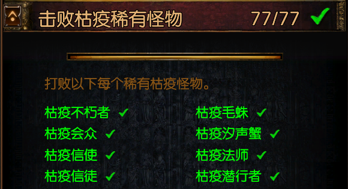
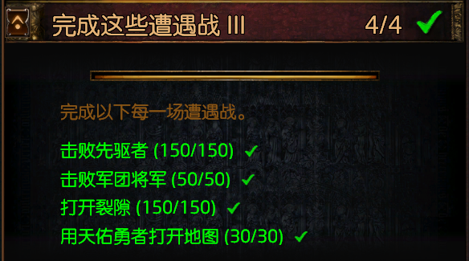
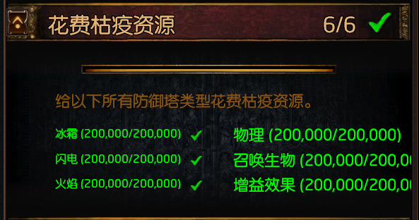
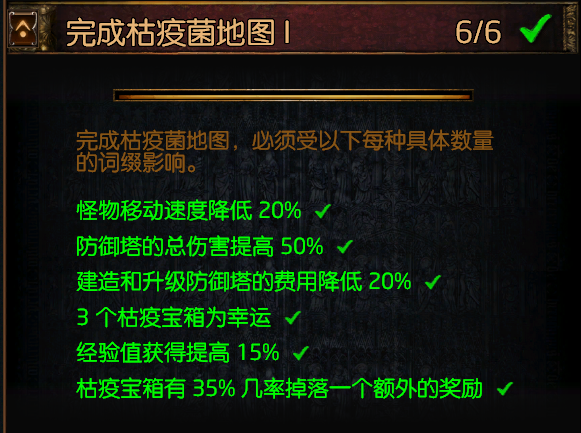
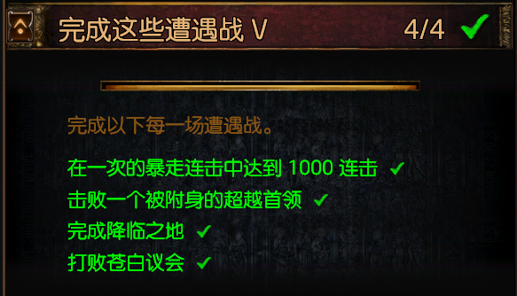
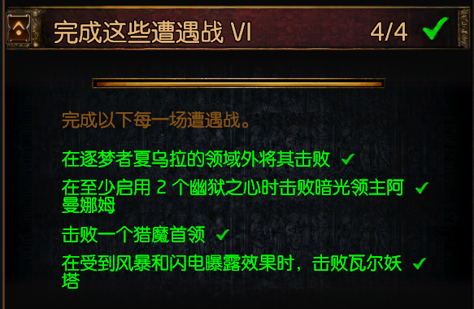
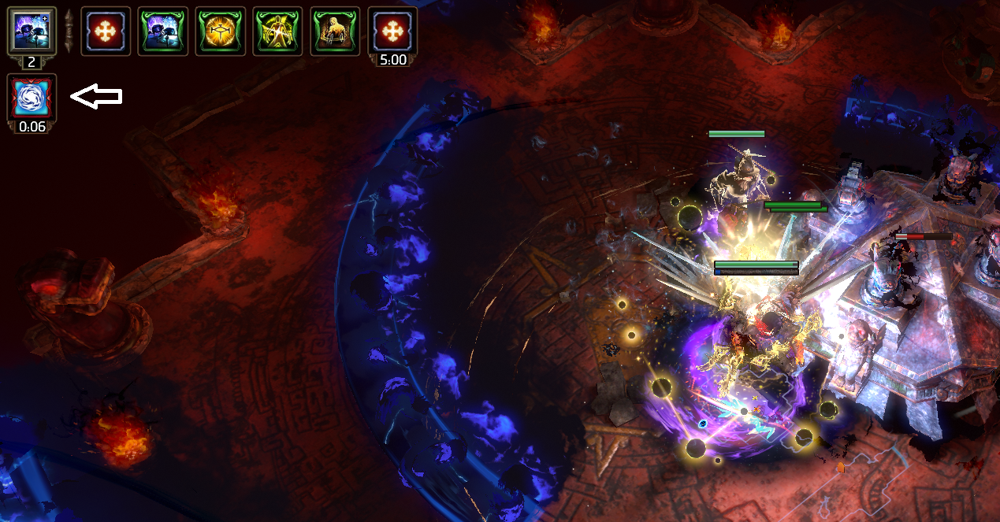

肝...开枯疫图会快点

有点需要的技巧的挑战来了（除了第4条 其他都能蹭）
1.T8幽魂监牢  先把boss磨到剩下血皮 回城再进等她恢复护盾到满 用只有混沌伤害的技能打死就好 必须只有混沌伤害才能穿盾
2.T4咒怨陵墓 给这个图的boss上2个诅咒再将它打死 必须要有+1诅咒的装备或者天赋 具体有啥自己想想
                    需要注意的是 第一次给他放诅咒 他会自己解掉 然后免疫一段时间 要等头上确实有两诅咒再杀
3.T5冰川  让它皮...皮到歇了3次 就可以宰了
4.T5幽魂宅邸  这个翻译有问题 不是boss被不洁之光影响 而是要人物自己 第一阶段直接秒 等第二阶段他放暗黄色的不洁光柱跟着你 你吃到debuff了 秒掉他就好

这里要注意的是-。- 这个军团将军啊  TM的 不是上赛季的军团 只是札娜词缀的那个红刃军团
这4个都是札娜词缀 先驱可以上先驱车很快的  
军团的话 极寒 灯塔 这两张图固定有一个将军
裂隙和天佑只能肝了

1.清澈圣油X2  2.翻译错误 不需要50%也不可能50% 20%而已 一个墨色圣油就好
3.琥珀圣油  4.水蓝圣油X2  5.天蓝圣油  6.金色圣油+漆黑圣油 很贵...

1.需要有暴走的暗金腰带 或者暗金手套 或者 暗金双手斧 只要装备的时候杀了1只怪以上 在换回原来的装备就能持续...蘑菇图里面很容易就能达成 不能蹭
2.这个看脸 需要开罪魂圣甲虫和地图超越词缀 很可惜的是札娜词缀都没有这两词缀 预言神秘入侵者会出现超越boss 不过还是需要看脸开图触发 引罪魂上它身
已经有简单的方法了:
首先先要有神秘入侵者预言 然后准备一堆终止苦难预言(击杀稀有怪出一只鬼魂) 开图直到触发预言 接着进去会有一只超越首领 先不管 去清出一片空旷区域 留一只稀有

1.野生夏乌拉 就是地图上的裂隙手 开那个有时候会出各种裂隙boss 需要遇到一只夏乌拉boss 脸黑的我开了500C没出 一共出了27次夏乌拉    最后直接叫别人出了 马上喊我传过去蹭的
2.暗光领主阿曼娜姆  地图上的深渊洞boss 有两种 这是其中一只 幽狱之心就是他放出来的水晶 不是转阶段柱子哦
   只要最后一阶段 留两个水晶打死他就好 注意-。- 4个水晶的话 他是无敌的
3.猎魔首领 这个上赛季 上上赛季也有 集市在通货里面的拓印的封魔之玉找这几个(苍空凶鸟 深海蜘蛛蟹 暗夜混毒魔蛛 大地巨虎) 有些是很便宜的
4.神庙boss 需要有一个 风雷之间房—飓风引擎—腐化风暴  都行 没必要3级
   boss战的时候 需要被地图不是出现的风暴打一下受到buff    然后再吃一下boss的闪电横扫 扫到会获得debuff闪电脆弱 在这两个状态都在自己身上时 击杀boss
   
   