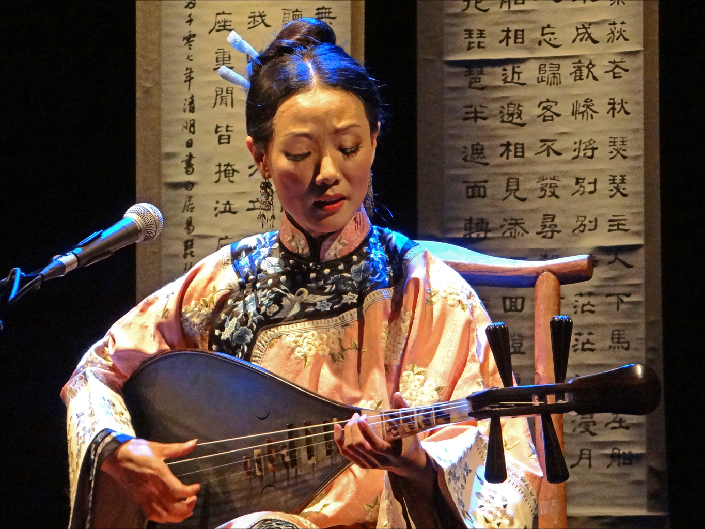
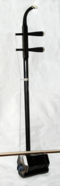
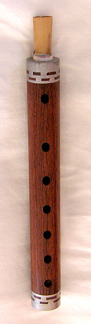
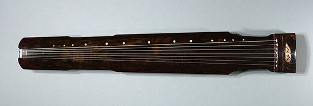
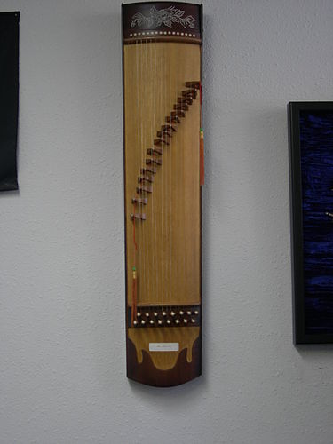
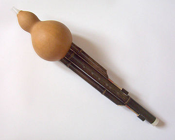
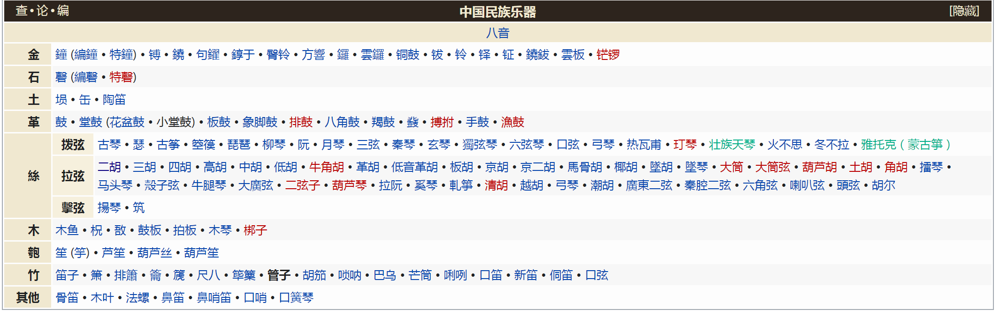

[toc!?theme=red]

**上古造律，其次听音，其后算律**
本文主要总结传统乐器及其技法，最终希望用电脑合成方式尽可能还原其的音色。
作为照明设计师难免有不专业的地方，如有更专业和全面的信息烦请留言，谢谢！

## 1 琵琶技法

视频集
https://www.bilibili.com/video/BV1kt411r7sH/
右手有彈、挑、夾彈、滾、雙彈、雙挑、分、勾、抹，摭、扣、拂、掃，輪、半輪等指法，
左手有揉、吟、帶起、捺打、虛按、絞弦、泛音、推、挽、綽、注等技巧

## 2 二胡技法

视频集
https://www.bilibili.com/video/BV1wW411L7fe

 - 以用弓的長度區分

全弓|長弓|短弓

 - 以使用部位區分

弓尖|弓根|前弓|中弓|後弓

 - 以運弓速度區分

顫弓|快弓|慢弓

 - 以弓序區分

推弓|拉弓|分弓|連弓|斷弓|頓弓

 - 以音色區分

連奏弓|跳弓|飛弓|拋弓|擊弓|大擊弓|彈輪弓|雙弦快速抖弓|指法|揉弦|自然泛音|人工泛音|偽泛音|滑音|顫音|打音|撥弦

## 3 管子
https://www.bilibili.com/video/BV1Yt411b7cA?p

打音的练习|垫音练习|溜音|指颤音|滑音|齿音

## 4 古琴

https://www.bilibili.com/video/BV1jW411S7zu

 - 右手的组合及特殊指法：

历：快速连挑2弦
小撮：同时挑、勾2弦
大撮：同時托、勾2弦
轮：快速连续摘、踢、挑
背锁：踢、抹、挑顺次弹奏
短锁：抹、勾、踢、抹、挑顺次弹奏
长锁：抹、勾、踢、抹、挑、抹、勾顺次弹奏
双弹：快速连踢、连挑相邻2弦
拨剌：食指、中指、無名指同时向内拨相邻两弦为“拨”、反向为“剌”
滚拂：从高音到低音连摘数弦称为“滚”，从低音到高音连抹数弦称为“拂”

 - 左手拨弦發声指法：

罨：大指击弦出声
掐起：大指按弦撤离出声
带起：無名指按弦撤离出声

## 5 古筝

https://www.bilibili.com/video/BV1gZ4y1W7ns?p
https://www.bilibili.com/video/BV1sx411q7RJ?p

 - 右手拨弦發声指法

托：大指向外撥弦
擘：大指向內撥弦
抹：食指向內撥弦
挑：食指向外撥弦
勾：中指向內撥弦
剔：中指向外撥弦
花：大指在板前花帶出連撥數弦
連托：大指向外由高音至低音依次連續撥弦
連擘：大指向內由低音至高音依次連續撥弦
連抹：食指向內由低音至高音依次連續撥弦
連挑：食指向外由高音至低音依次連續撥弦，戴假甲者不用此法
連勾：中指向內由低音至高音依次連續撥弦
搖：大指反覆托擘一條弦
密搖：較一般的搖更快速
勾搭：中、大指先後彈出八度音列
小勾搭：用抹、托彈出少於八度的2個音列
雙托：用大指由內向外連撥2條弦，奏出大二度或增二度和弦
雙擘：用大指由外向內連撥2條弦，奏出大二度或增二度和弦，戴假甲者不用此法
雙抺：用食指由外向內連撥2條弦，奏出大二度或增二度和弦
雙勾：用中指由外向內連撥2條弦，奏出大二度或增二度和弦
撮：中、大指同時勾、托奏出八度和弦
反撮：中、大指同時剔、擘奏出八度和弦
小撮/食指撮：食、大指同時抹、托奏出少於八度的和弦
小反撮：食、大指同時挑、擘奏出少於八度的和弦，戴假甲者不用此法

 - 左手拨弦發声指法：

按：彈奏前按弦，將空弦音升高小二度或更高
上滑：彈奏後按弦，奏出空弦音帶滑音升高小二度或更高的
下滑：彈奏前按弦至特定音高，彈奏後放手，奏出按弦音帶滑音至空弦音
猱：彈奏空弦音後，反覆上、下滑音
顫音：快速的猱

## 6 葫芦丝

https://www.bilibili.com/video/BV1hs411h74a
 - 吐音。吐音是葫芦丝演奏中较重要的技法。吐音又分为单吐、双吐、三吐三种。
 - 连音。连音是常用技巧之一。适用于抒情如歌的乐句或乐段。用符号“⌒”（连音线）表示，连音线内的音除了吐第一个音，其余的音均不用吐，吹奏连音时要强调连贯、流畅。
 - 滑音。滑音及技法在葫芦丝演奏中被广泛使用，其效果具有圆滑、华丽的特点，应用滑音技法可以模拟人声和弦乐器上的抹音效果。滑音又有上滑音、下滑音、复滑音三种。
 -  震音。利用震音技巧可以获得如同歌唱般的“声浪”效果，极大的丰富音乐的表现力，是人们揭示内心活动、抒发内心情感的重要手法之一。震音又有气震音和指震音两种
 - 颤音。颤音是由两个不同音高的音快速交替出现而构成。具体要求是原音发出后紧接着快速而均匀的开闭其上方二度或三度音的音孔，符号为“tr”或 “tr ～～～～
 - 叠音、打音。两种演奏的技法和效果上差不多，关于它们的定义也是各执一词。就是在某个音出现前的瞬间加奏一个时值极短的高二度过三度的音，叠音用符号“ 又 ”表示，打音用符号“扌”表示。

## 00 其它传统古典乐器

https://www.bilibili.com/video/BV1ux41187D1?p=8
仅有部分演奏曲段，大部分为濒危或失传
篪、筑、曲颈琵琶（濒危）、轧筝（濒危）、九孔龠、瑟（复原，古瑟已失传）、廿五弦瑟

主要参考：https://www.bilibili.com
          https://zh.wikipedia.org/wiki

