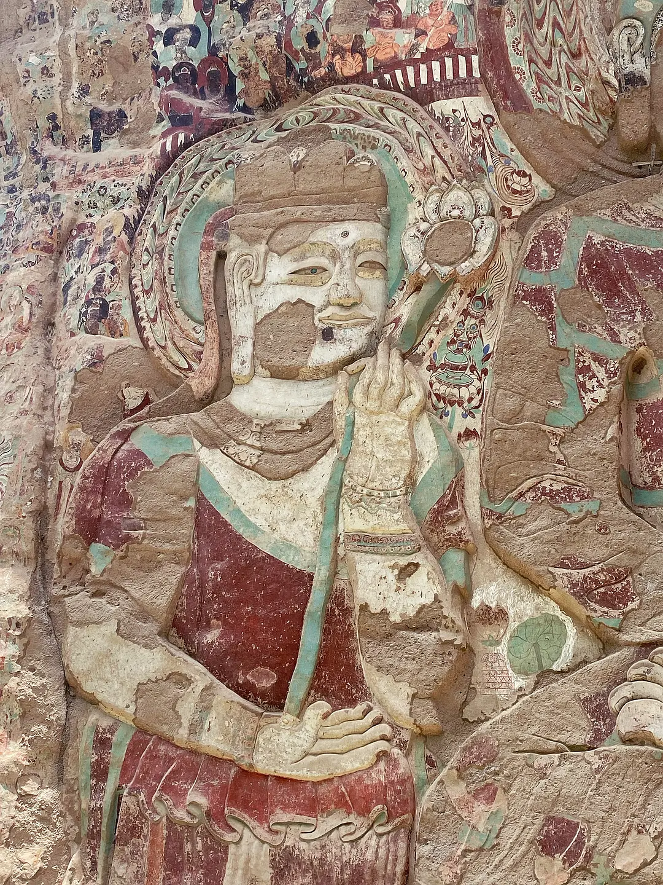
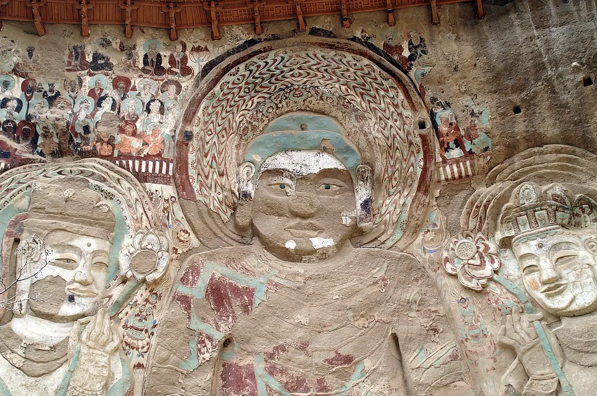
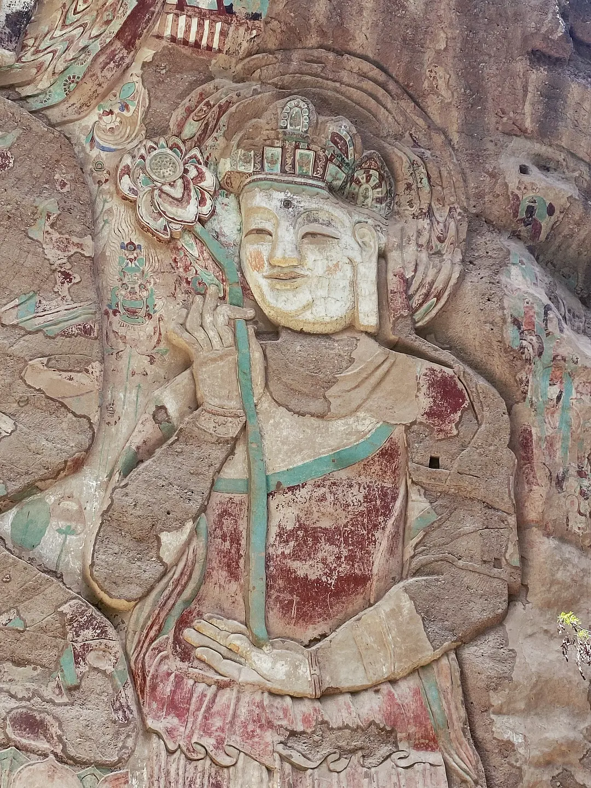
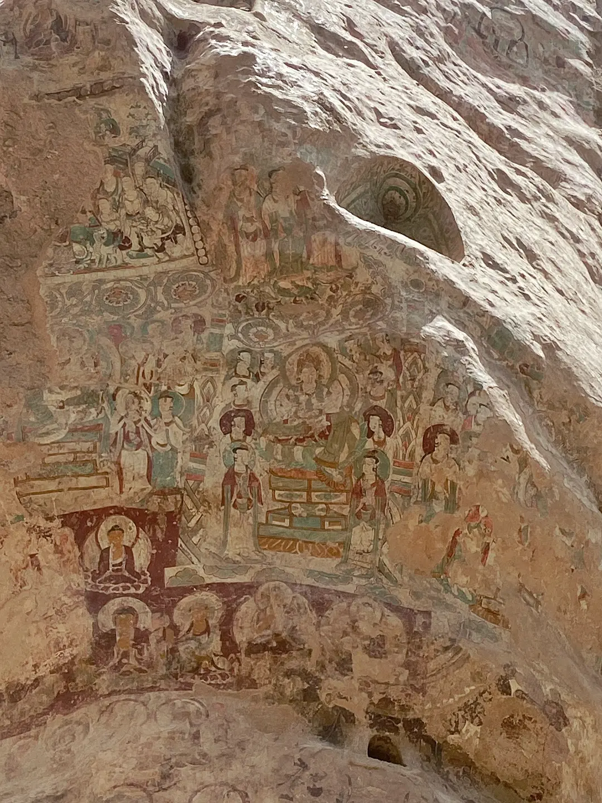
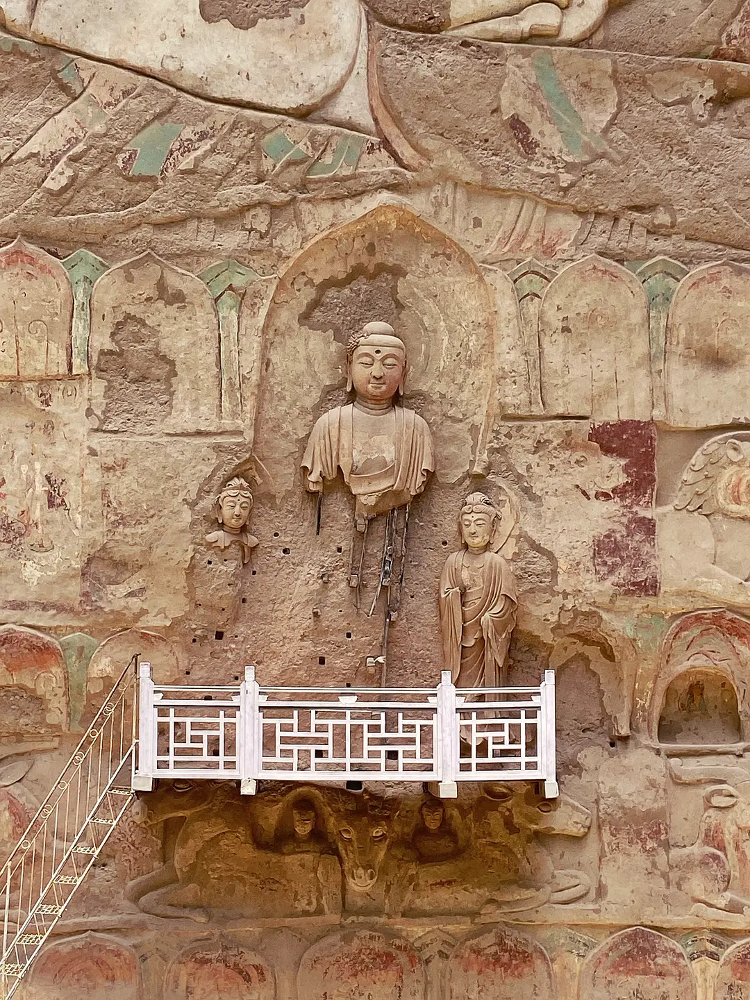
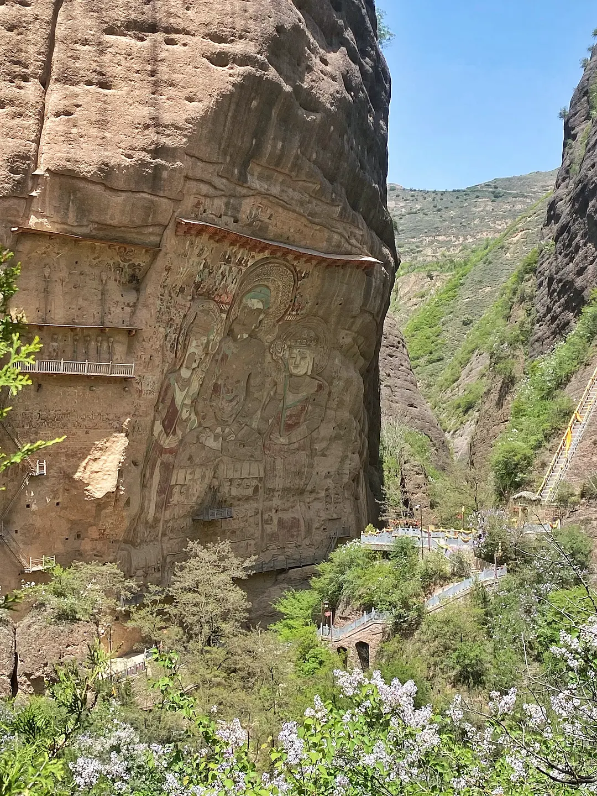
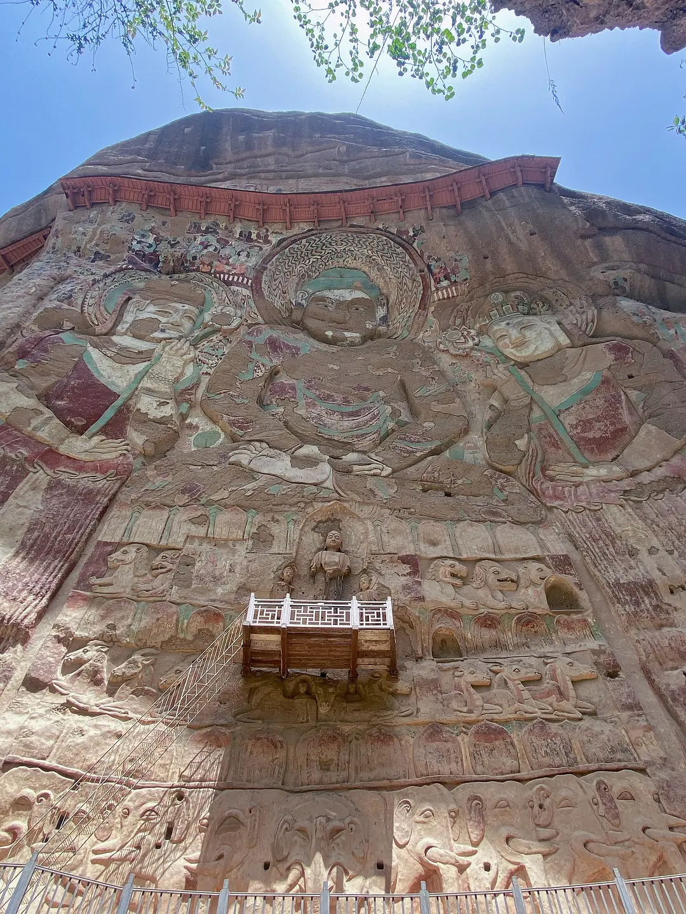
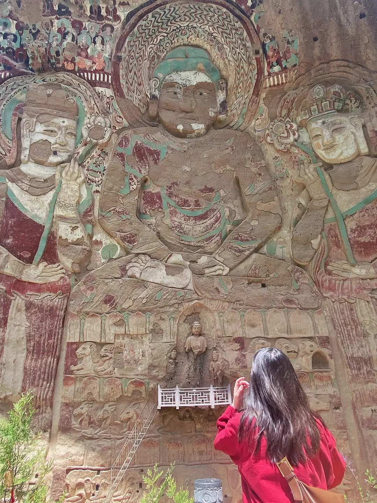
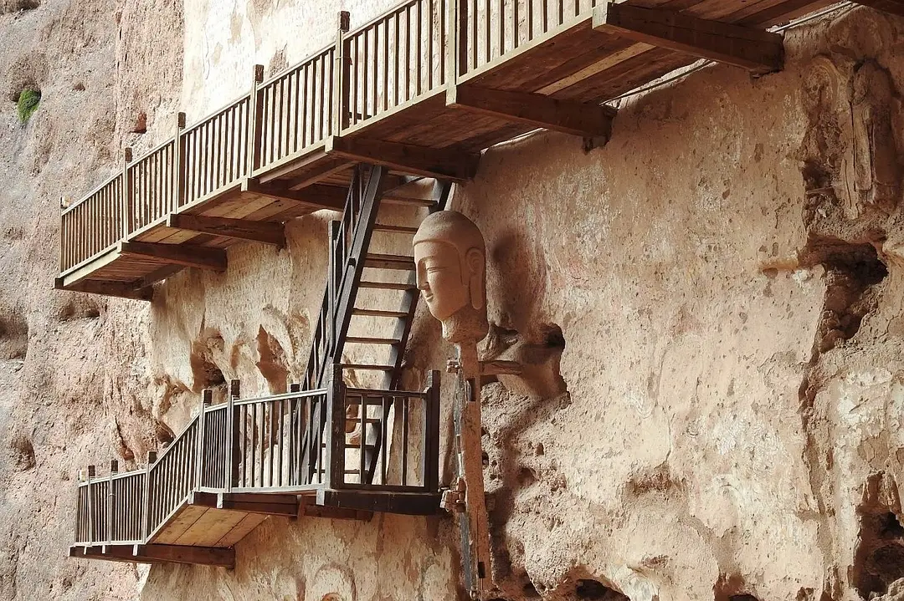

拉梢寺拉梢寺，位于天水市和定西市之间一个叫武山的小县城附近，有一个北周时期建造的巨大摩崖石刻，40多米高，顺着山势内凹处雕刻而成，石刻四周布满壁画，石刻脚部有宋初重建的泥塑，因为避光+干燥，石刻细节和壁画保存的相对完整，附近还有千佛洞等石窟群，整个石窟群建在一个丹霞巨石群内部隐蔽处，山体对面的平台可以靠近石刻，印象特别深的是石刻旁的寺庙檐端悬挂铜铃，山内常常有风，四处铃铛和树上挂的木牌碰撞发出的清脆声响在山谷里一直回荡，石刻造型留有小乘佛教痕迹，在我国石窟艺术中十分罕见。山中还有一个依山而建的道观，于山凹洞穴处建造，雨季山崖上水流顺势而下，宛如仙境，不明白为什么这么牛逼的地方如此默默无闻，连资料都不太搜的到，景区内也无导游，游客极少，多是香客与僧人。

拉梢寺位于天水市和定西市之间的一个叫巫山的小县城附近。 有一座巨大的崖石刻，始建于北周。 它高40多米，沿着凹山雕刻而成。 石雕四周是壁画。 石刻脚下有宋初重建的泥塑。 由于避光避光，石刻、壁画的细节比较完整。 附近还有千佛洞等洞穴。 山对面的平台可以靠近石刻。 最令人印象深刻的是，在石刻旁边的寺庙屋檐上悬挂着铜铃。 山上常有风。 钟声与挂在树上的木牌碰撞的清脆声响在山谷中回荡。 有上座部佛教的痕迹，在中国石窟艺术中极为罕见。 山上还建有道观。 它建在山上的一个山洞里。 雨季的水从悬崖上流下来，宛如仙境。 我不明白为什么这么壮观的地方这么不为人知。 甚至信息也不是很容易搜索。 景区内没有导游，游客很少，主要是香客和僧侣

　一壁如来通天立，四围紫座皆佛陀。说的就是天水市武山县水帘洞景区。水帘洞位于甘肃省武山县洛门镇榆盘乡钟楼湾村东南2公里处的鲁班峡谷之中，谷中群峰叠嶂觅无路，乱石开径别有天，谷涧溪水潺潺，景色幽静宜人，是渭河流域中极具文化遗址的风景名胜区之一。这里原有多处佛教遗址，有七寺（金瓦寺、观台寺、千佛洞、拉梢寺、显圣池寺、峰团寺、砖瓦寺）、五台一说。水帘洞石窟位于莲花山下，因山巅常有清泉溪流，尤其雨过天晴，流水似珠帘垂洞前，因此得名“水帘洞”。

拉梢寺摩崖造像拉梢寺摩崖造像是国北周佛教摩崖造像。拉梢寺又称大佛崖，位于甘肃省武山县城东25公里鲁班峡响河沟北岸。原有崖前寺院建筑，现已不存。崖面险陡，高60余米。其上有北周巨大的石胎泥塑一佛二菩萨一铺。佛结跏趺坐，高近40米，低平肉髻，面相浑圆，眉宽眼大，鼻阔唇厚，颈短肩方；身着紧窄的通肩袈裟，施土红色，绘石绿色田相纹，双手叠于腹前作禅定印。佛两侧胁侍菩萨立像，高髻宝冠，宝缯垂肩，着绿缘红色僧□支，披巾绕肩穿肘而下，腰束裙，跣足，双手捧莲枝供养。佛、菩萨像两侧画成排的弟子、菩萨和力士等群像。方形佛座分上下 6层浮塑仰莲、卧狮、卧鹿大像，中间开一尖拱楣浅龛，龛内塑一立佛二菩萨。这铺造像上方筑木构风雨檐，右方有上下2层塑像，上层为5立佛，下层为10立佛，大部已残，又开圆券龛8个，其余崖面满绘说法图、千佛、飞天等壁画。（转自金申博客）

举报/反馈

