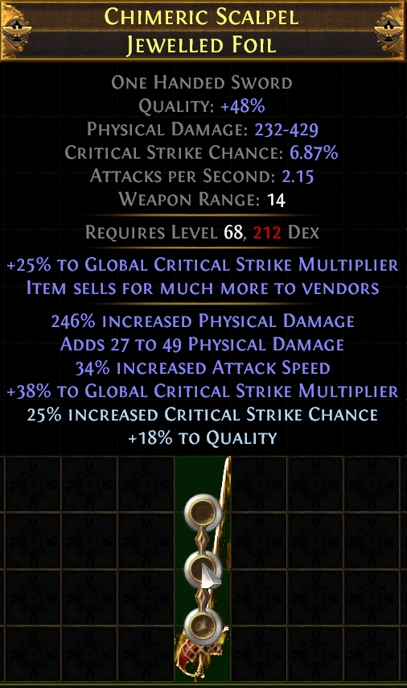

Well, its finally completed! A week of over-average aug/removes hitting the influence prefix, the best crafting collaboration of the league has now been completed! We were spamming Deafening Zeals/Aug Phys on our own base to hit merciless/Zeal until we ended up collabing.

Big shoutout to Mobius, Chan, Plushies, and Van as well as the usual group (Snap, Empyrian, Redsameri, Evan, Keepo, and dgz (for killing our sets of 24x Harvest boss plots)). This craft would not have been possible without any of these people especially with the amount of t4 seed crafts, smaller seeds required (Over 250 t4 blisterfruits were used for the final steps), and how much ex ended up being needed for the crafted mod (Plushies? 130ex? come on dude :D). We decided to join our efforts together after we realised we were working on the same project in parallel.

Now for the crafting methods for rule10:

Started with a magic Deafening Essence of Zeal (30% attack speed) + Merciless (170-179% physical damage) i84 foil, with 30% quality.

Imprinted the magic base with beasts to get Flaring (t1 flat physical damage)

Divined prefixes to 178%/perfect flaring

Filled suffixes with multimod+random suffix

Warlord slammed (doesnt matter what you get here unless its t1 warlord Hybrid Phys%+Attackspeed%)

Change crafted mod to critical strike chance suffix

Augment Critical modifier with a crafted prefix so that its guaranteed suffix

Add/remove Critical until t1 Crit Multiplier

Add/Remove Influenced modifier until t1 Warlord Hybrid Phys%/AS%

Snap hits 68%phys/4%as so that we don't need to do any divining of prefixes lmao

Divine suffixes to 30% attack speed/38% critical multiplier

Craft Critical Strike Chance/Quality hybrid to 25%/18% quality.

Profit???

Advanced mod descriptor comment: https://i.imgur.com/YieTGlk.png